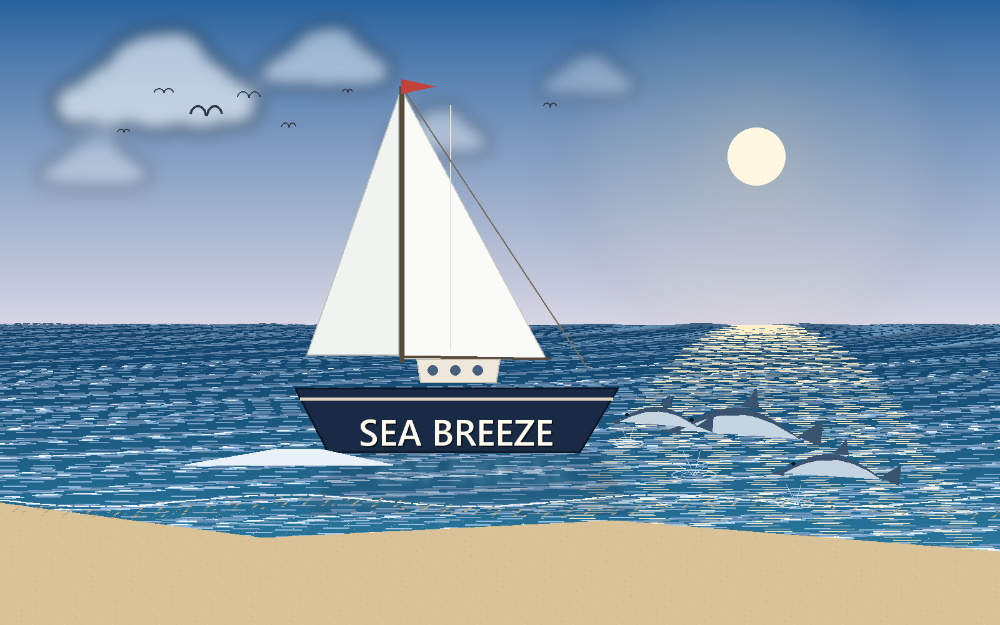
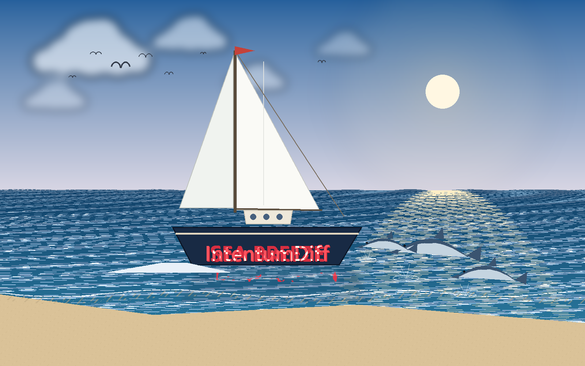
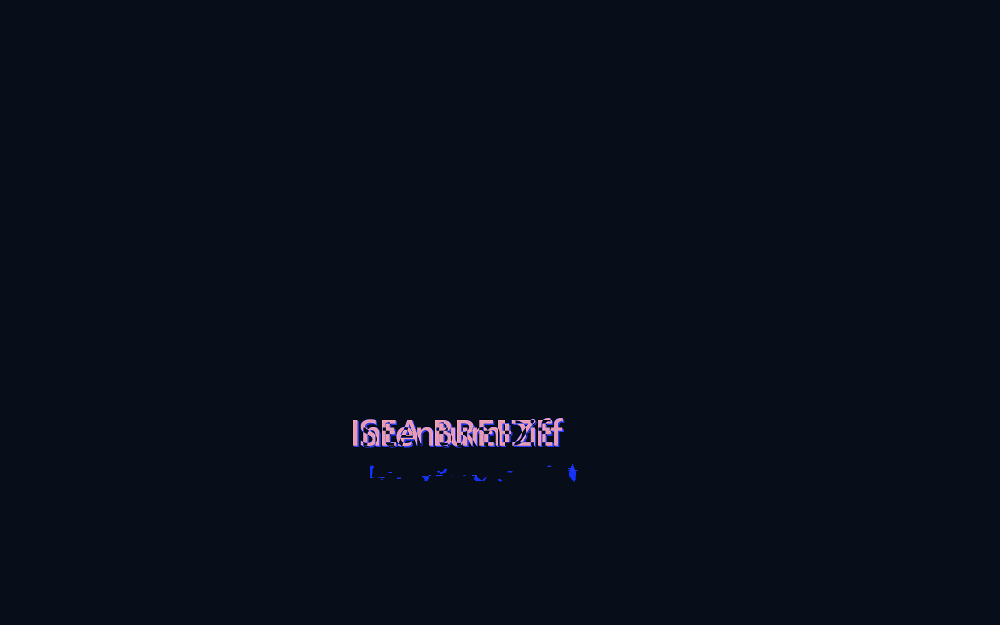
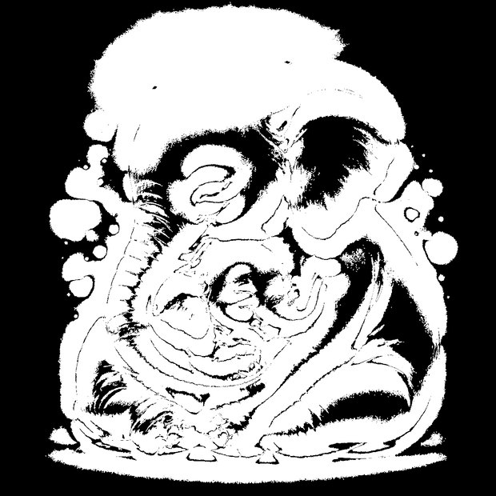
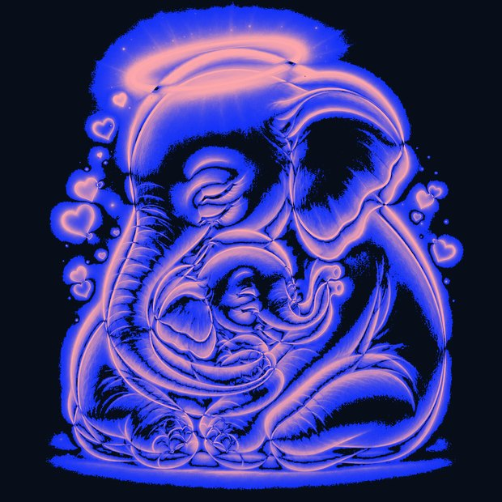
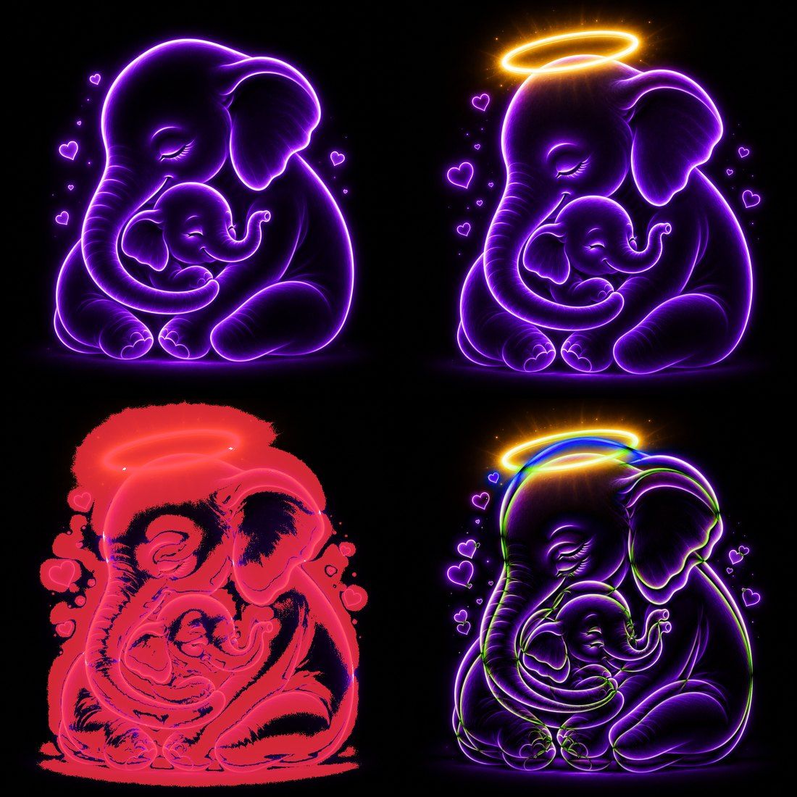

# Diffing images

A line diff of a PNG tells you the bytes changed. That is true and useless.

Re-export an image from a different tool and every byte moves while the picture is identical.
Change one icon in a sprite sheet and almost no bytes move while something visible broke.
Neither case is answerable by comparing bytes, so most review tools show "binary file differs"
and leave you to open both in another application.

IntentumDiff compares images **perceptually** — what the picture looks like, not how it was
encoded.

## A worked example

Two renders of the same scene. One thing changed — the name on the hull.

<figure markdown>

<figcaption>Before — the hull reads <code>SEA BREEZE</code></figcaption>
</figure>

<figure markdown>

<figcaption>After — the hull reads <code>IntentumDiff</code></figcaption>
</figure>

Both files were re-encoded, so **every byte differs**. A byte comparison reports "binary file
differs" and stops there — technically true, and useless. It cannot tell you whether the sky
changed, the boat moved, or someone edited two characters.

Here is what the engine reports:

```text
changed pixels : 10,418  (0.6510% of the image)
dimensions     : 1600x1000 -> 1600x1000  (unchanged)
```

And the overlay marks *only* the lettering — not the sea, the sun, the clouds or the sand:

<figure markdown>

<figcaption>Overlay — changed regions in red, everything unchanged left alone</figcaption>
</figure>

The heatmap answers the follow-up question, "is that the only place?", at a glance:

<figure markdown>

<figcaption>Heatmap — a single hotspot, so nothing else moved</figcaption>
</figure>

"0.15% of pixels changed, all of them here" is something you can act on. "The bytes differ" is
not.

## A second example: when your eyes are wrong

The sailboat is the easy case — a small change you could have found by staring. This is the
one that matters more.

Two versions of the same artwork. Ask anyone what changed and they will tell you: *a halo was
added*.

<figure markdown>

<figcaption>Before</figcaption>
</figure>

<figure markdown>

<figcaption>After — a halo was added. That is the obvious change, and it is not the whole story.</figcaption>
</figure>

The engine disagrees:

```text
changed pixels : 826,452  (52.556% of the image)
dimensions     : 1254x1254 -> 1254x1254  (unchanged)
mean abs error : 26.47
RMSE           : 60.05
hotspots       : 443
summary        : Image changed substantially: 52.6% of pixels differ.
                 Dimensions unchanged. Most changes are concentrated in the center region.
```

**Over half the image changed.** Not a halo — a re-render. The change mask shows exactly where:

<figure markdown>

<figcaption>Change mask — white is changed. The halo is the blob at the top; everything else
is the elephant being redrawn.</figcaption>
</figure>

Every edge moved. The trunk ridges, the ear folds, the calf's face, the floating hearts, the
ground shadow — the whole figure was regenerated slightly brighter and fractionally rescaled.
Two pixels of drift on a glowing edge is invisible to the eye and unmissable to the engine.

That gap is the entire point. "I only added a halo" is what the author believed and what a
reviewer would have approved. If this were a UI asset, a logo, or an icon set, the halo is the
change you discussed and the other 51% is the change that ships unnoticed.

<figure markdown>

<figcaption>Heatmap — intensity of change. The halo dominates, but the outline glows throughout.</figcaption>
</figure>

<figure markdown>

<figcaption>Difference — unchanged pixels go dark, so what remains is what moved.</figcaption>
</figure>

Note the engine also reported:

```text
warning: Ignored 3276 tiny changed pixels below region_min_area=4.
```

It tells you what it discarded and why. A tool that silently drops noise is a tool you cannot
calibrate; `--region-min-area` is yours to move.

## Comparison modes

No single view answers every question, so the review surface offers several. These are live —
drag, fade and toggle them.

<div class="id-modes" markdown="0">
  <figure>
    <div class="id-swipe" id="id-swipe">
      
      <div class="id-swipe-top"></div>
      <div class="id-swipe-handle"></div>
    </div>
    <input type="range" min="0" max="100" value="50" id="id-swipe-range"
           aria-label="Swipe between before and after">
    <figcaption><strong>Swipe</strong> — drag the divider. Best for alignment and layout shifts.</figcaption>
  </figure>

  <figure>
    <div class="id-onion">
      
      
    </div>
    <input type="range" min="0" max="100" value="50" id="id-onion-range"
           aria-label="Fade between before and after">
    <figcaption><strong>Onion skin</strong> — fade one into the other. Best for gradual changes
    like colour grading. Watch the outline thicken as you cross the middle.</figcaption>
  </figure>

  <figure>
    <div class="id-onion">
      
      
    </div>
    <button type="button" id="id-blink-btn">Start blinking</button>
    <figcaption><strong>Blink</strong> — alternate rapidly. The eye is exceptionally good at
    catching what jumps, which is how astronomers found moving objects on photographic plates.</figcaption>
  </figure>

  <figure>
    
    <figcaption><strong>Change lasso / overlay</strong> — changed regions marked directly on
    the image, so you review in place rather than in a separate pane.</figcaption>
  </figure>
</div>

<style>
.id-modes{display:grid;gap:2rem;grid-template-columns:repeat(auto-fit,minmax(280px,1fr))}
.id-modes figure{margin:0}
.id-modes img{display:block;width:100%;border-radius:6px}
.id-modes input[type=range],.id-modes button{width:100%;margin-top:.5rem}
.id-swipe,.id-onion{position:relative;line-height:0;border-radius:6px;overflow:hidden}
.id-swipe-top{position:absolute;inset:0;width:50%;overflow:hidden}
.id-swipe-top img{width:auto;height:100%;max-width:none}
.id-swipe-handle{position:absolute;top:0;bottom:0;left:50%;width:2px;background:#fff;
  box-shadow:0 0 0 1px rgba(0,0,0,.45);pointer-events:none}
.id-onion img:last-child{position:absolute;inset:0}
</style>
<script>
(function(){
  var sw=document.getElementById('id-swipe-range');
  if(sw){sw.addEventListener('input',function(){
    var box=document.getElementById('id-swipe');
    box.querySelector('.id-swipe-top').style.width=sw.value+'%';
    box.querySelector('.id-swipe-handle').style.left=sw.value+'%';
    box.querySelector('.id-swipe-top img').style.width=box.clientWidth+'px';
  });sw.dispatchEvent(new Event('input'));}
  var on=document.getElementById('id-onion-range');
  if(on){on.addEventListener('input',function(){
    document.getElementById('id-onion-top').style.opacity=on.value/100;});}
  var btn=document.getElementById('id-blink-btn'),img=document.getElementById('id-blink'),t=null;
  if(btn){btn.addEventListener('click',function(){
    if(t){clearInterval(t);t=null;img.style.opacity=1;btn.textContent='Start blinking';return;}
    btn.textContent='Stop blinking';
    t=setInterval(function(){img.style.opacity=img.style.opacity==='0'?'1':'0';},450);});}
})();
</script>

Side by side is the fifth mode, and the default: the two images unmodified, for orientation
before you pick one of the above.

The engine also emits a **contact sheet** — every view in one image, for pasting into a review
comment or an issue:

<figure markdown>

<figcaption>Contact sheet — the whole comparison as a single shareable artifact.</figcaption>
</figure>

## In the editor

Everything above is the engine's output. This is that same comparison inside VS Code, on the
same two files:

<figure markdown>

<figcaption>The perceptual asset diff in VS Code — swipe mode, change outlines on, hotspots
ranked beside it.</figcaption>
</figure>

Reading it left to right:

- **`PERCEPTUAL DIFF`** next to the path, because the file is an image — the review switched
  strategy on its own rather than reporting "binary file differs"
- **Mode tabs** — the same Side by side / Onion / Swipe / Difference you dragged above, here
  with **Swipe** active and the divider down the middle
- **Outline changes** draws the change lasso directly over the artwork. The dashed boxes are
  scattered across the whole figure, not gathered round the halo — the 52% is visible as
  shape, before you read a single number
- **Changed-region hotspots**, ranked and navigable. `Hotspot 1` is the real one at
  **52.1% · 300,667 pixels · center region**; the rest are 4- and 5-pixel specks. Ranking
  means you look at the one that matters first
- **Channel histograms** per channel, for global shifts a lasso cannot show — a re-encode, a
  colour-profile change, a quality drop

`Native diff`, `Semantic-only`, `Stage` and `Revert` sit on the same toolbar, so an image
review is a normal part of the flow rather than a detour into another app.

## Finding the change

- **Hotspots** highlight regions that differ most, so a single altered icon in a large sprite
  sheet is found for you rather than hunted
- **Change lasso** outlines changed regions directly on the image
- **Histograms** compare colour distribution, which catches global changes — a re-encode, a
  colour-profile shift, a compression-quality drop — that are easy to miss by eye

## Why this catches real problems

The cases that reach production are usually the invisible ones:

- An asset re-exported at lower quality. Looks fine at review size, blocky at full size —
  the histogram shows it immediately
- A colour profile change that shifts every pixel slightly. Byte diff: everything changed.
  Perceptual diff: a uniform shift, visible in one glance at the difference view
- One sprite altered in a large sheet. Byte diff: a small change somewhere. Hotspots: exactly
  where

## From the command line

```bash
intentumdiff assets --help
```

## Where the work happens

All image artifacts are produced by the **Rust engine**, not the editor. The review surface
displays what the engine computed and does no image processing of its own, so the CLI and the
extension give identical results — and a comparison is reproducible outside the editor.

## Reproducing this

Every number and image on this page came from this command:

```bash
intentumdiff assets diff --before ellie1.png --after ellie_2.png --out ./out --json
```
