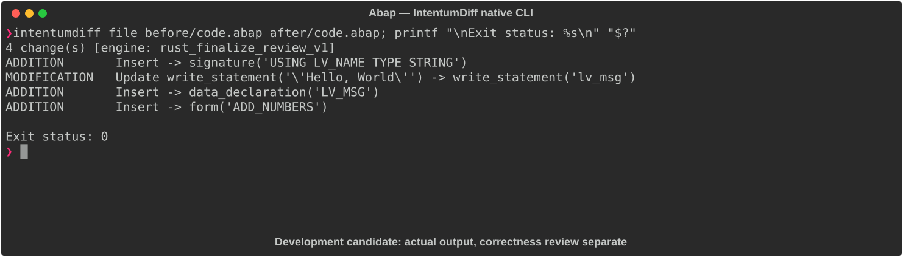

# Abap

[All languages](../gallery.md)

These real terminal captures use a historical development build. They are not current release certification; independent output review and current installed-wheel scenario checks remain pending.

## Overview

This worked example compares `code.abap`. Advertised filename extensions: `.abap`.

## What changes

greet gains a required string input and prints a personalized exclamation greeting using lv_msg; add_numbers is added with two integer inputs and a changing result assigned their sum.

## Before

````text
REPORT z_demo.

FORM greet.
  WRITE: 'Hello, World'.
ENDFORM.
````

## After

````text
REPORT z_demo.

FORM greet USING lv_name TYPE string.
  DATA(lv_msg) = |Hello, { lv_name }!|.
  WRITE: lv_msg.
ENDFORM.

FORM add_numbers USING a TYPE i b TYPE i CHANGING result TYPE i.
  result = a + b.
ENDFORM.
````

## Things to know

- Signature and printed text change; this is not merely extraction or formatting.

- No callers or ABAP runtime/version validation are provided.

## Recorded output



Recorded from a real native CLI through rs-rich-record. A refactoring label does not prove equivalent behavior. [Build identities](../provenance.md).

## Scenario coverage

| Scenario | Status |
|---|---|
| Meaningful edit | Source example reviewed; output captured; independent result certification pending |
| Unchanged content | Not yet certified for this candidate |
| Populate / clear a file | Not yet certified for this candidate |
| Add / delete an entity | Not yet certified for this candidate |
| Rename a symbol | Not yet certified for this candidate |
| Move / reorder code | Not yet certified for this candidate |
| Formatting only | Not yet certified for this candidate |
| Git file rename / move | Not yet certified for this candidate |
| Mixed move and edit | Not yet certified for this candidate |
| Invalid syntax / actionable error | Not yet certified for this candidate |
| Guardrail review | Not yet certified for this candidate |

## Try it

Save the two source blocks as separate files with the shown extension, then compare them:

```bash
intentumdiff file before/code.abap after/code.abap
```

The installed Python wheel includes its parser components. The native CLI requires a component directory. Compare the result with the source change described above; agreement between APIs alone is not proof of correctness.
