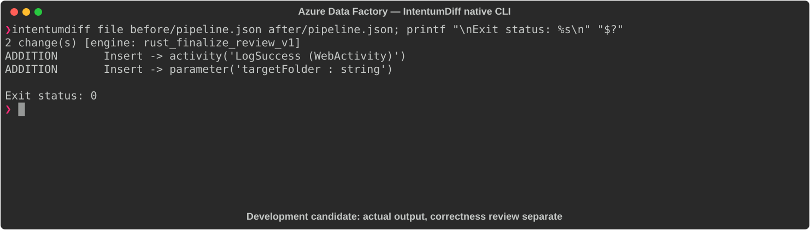

# Azure Data Factory

[All languages](../gallery.md)

These real terminal captures use a historical development build. They are not current release certification; independent output review and current installed-wheel scenario checks remain pending.

## Overview

This worked example compares `pipeline.json`. Advertised filename extensions: `.json`.

## What changes

Add targetFolder string parameter defaulting to output and a LogSuccess POST WebActivity dependent on CopyData succeeding; preserve existing CopyData inputs, outputs and copy configuration.

## Before

````text
{
  "name": "CopyPipeline",
  "properties": {
    "activities": [
      {
        "name": "CopyData",
        "type": "Copy",
        "inputs":  [{"referenceName": "Source", "type": "DatasetReference"}],
        "outputs": [{"referenceName": "Sink",   "type": "DatasetReference"}],
        "typeProperties": {"source": {"type": "BlobSource"}, "sink": {"type": "BlobSink"}}
      }
    ]
  }
}
````

## After

````text
{
  "name": "CopyPipeline",
  "properties": {
    "parameters": {
      "targetFolder": {"type": "string", "defaultValue": "output"}
    },
    "activities": [
      {
        "name": "CopyData",
        "type": "Copy",
        "inputs":  [{"referenceName": "Source", "type": "DatasetReference"}],
        "outputs": [{"referenceName": "Sink",   "type": "DatasetReference"}],
        "typeProperties": {"source": {"type": "BlobSource"}, "sink": {"type": "BlobSink"}}
      },
      {
        "name": "LogSuccess",
        "type": "WebActivity",
        "dependsOn": [{"activity": "CopyData", "dependencyConditions": ["Succeeded"]}],
        "typeProperties": {"url": "https://example.com/log", "method": "POST"}
      }
    ]
  }
}
````

## Things to know

- targetFolder is declared but not referenced in the supplied pipeline.

- Deployment validity and the POST endpoint/body/authentication requirements are not established by this snippet.

## Recorded output



Recorded from a real native CLI through rs-rich-record. A refactoring label does not prove equivalent behavior. [Build identities](../provenance.md).

## Scenario coverage

| Scenario | Status |
|---|---|
| Meaningful edit | Source example reviewed; output captured; independent result certification pending |
| Unchanged content | Not yet certified for this candidate |
| Populate / clear a file | Not yet certified for this candidate |
| Add / delete an entity | Not yet certified for this candidate |
| Rename a symbol | Not yet certified for this candidate |
| Move / reorder code | Not yet certified for this candidate |
| Formatting only | Not yet certified for this candidate |
| Git file rename / move | Not yet certified for this candidate |
| Mixed move and edit | Not yet certified for this candidate |
| Invalid syntax / actionable error | Not yet certified for this candidate |
| Guardrail review | Not yet certified for this candidate |

## Try it

Save the two source blocks as separate files with the shown extension, then compare them:

```bash
intentumdiff file before/pipeline.json after/pipeline.json
```

The installed Python wheel includes its parser components. The native CLI requires a component directory. Compare the result with the source change described above; agreement between APIs alone is not proof of correctness.
