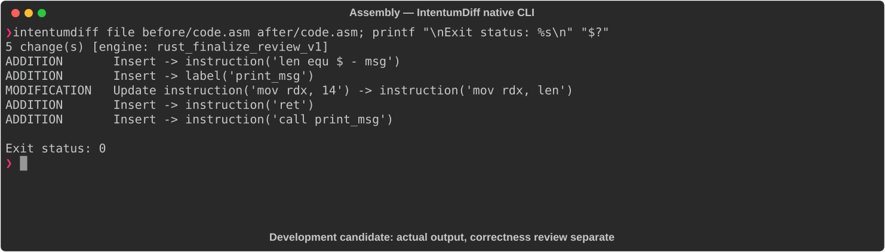

# Assembly

[All languages](../gallery.md)

These real terminal captures use a historical development build. They are not current release certification; independent output review and current installed-wheel scenario checks remain pending.

## Overview

This worked example compares `code.asm`. Advertised filename extensions: `.asm`.

## What changes

Extract write syscall sequence into print_msg with ret and call it from _start; replace literal byte count 14 with len equ $ - msg; preserve exit syscall and message bytes.

## Before

````text
section .data
    msg db "Hello, World!", 10
section .text
    global _start
_start:
    mov rax, 1
    mov rdi, 1
    lea rsi, [msg]
    mov rdx, 14
    syscall
    mov rax, 60
    xor rdi, rdi
    syscall
````

## After

````text
section .data
    msg db "Hello, World!", 10
    len equ $ - msg
section .text
    global _start
print_msg:
    mov rax, 1
    mov rdi, 1
    lea rsi, [msg]
    mov rdx, len
    syscall
    ret
_start:
    call print_msg
    mov rax, 60
    xor rdi, rdi
    syscall
````

## Things to know

- NASM-style x86-64 Linux syscall source; not dialect-neutral assembly.

- For these exact bytes len is 14, but added call/ret changes stack use and control flow; do not claim universal behavioral equivalence.

## Recorded output



Recorded from a real native CLI through rs-rich-record. A refactoring label does not prove equivalent behavior. [Build identities](../provenance.md).

## Scenario coverage

| Scenario | Status |
|---|---|
| Meaningful edit | Source example reviewed; output captured; independent result certification pending |
| Unchanged content | Not yet certified for this candidate |
| Populate / clear a file | Not yet certified for this candidate |
| Add / delete an entity | Not yet certified for this candidate |
| Rename a symbol | Not yet certified for this candidate |
| Move / reorder code | Not yet certified for this candidate |
| Formatting only | Not yet certified for this candidate |
| Git file rename / move | Not yet certified for this candidate |
| Mixed move and edit | Not yet certified for this candidate |
| Invalid syntax / actionable error | Not yet certified for this candidate |
| Guardrail review | Not yet certified for this candidate |

## Try it

Save the two source blocks as separate files with the shown extension, then compare them:

```bash
intentumdiff file before/code.asm after/code.asm
```

The installed Python wheel includes its parser components. The native CLI requires a component directory. Compare the result with the source change described above; agreement between APIs alone is not proof of correctness.
