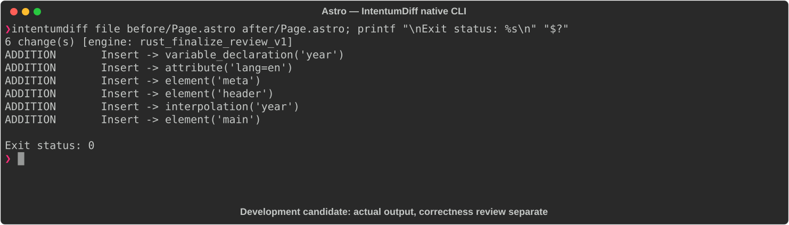

# Astro

[All languages](../gallery.md)

These real terminal captures use a historical development build. They are not current release certification; independent output review and current installed-wheel scenario checks remain pending.

## Overview

This worked example compares `Page.astro`. Advertised filename extensions: `.astro`.

## What changes

Add current-year computation and copyright/year text; add html lang=en and UTF-8 metadata; wrap heading and paragraph in header/main while retaining title and welcome text.

## Before

````text
---
const title = "My Site";
---
<html>
  <head><title>{title}</title></head>
  <body>
    <h1>Hello World</h1>
    <p>Welcome to my site.</p>
  </body>
</html>
````

## After

````text
---
const title = "My Site";
const year = new Date().getFullYear();
---
<html lang="en">
  <head>
    <meta charset="UTF-8" />
    <title>{title}</title>
  </head>
  <body>
    <header><h1>Hello World</h1></header>
    <main><p>Welcome to my site. &copy; {year}</p></main>
  </body>
</html>
````

## Things to know

- Year depends on execution/render timing; markup wrappers and metadata are meaningful changes, not whitespace-only.

## Recorded output



Recorded from a real native CLI through rs-rich-record. A refactoring label does not prove equivalent behavior. [Build identities](../provenance.md).

## Scenario coverage

| Scenario | Status |
|---|---|
| Meaningful edit | Source example reviewed; output captured; independent result certification pending |
| Unchanged content | Not yet certified for this candidate |
| Populate / clear a file | Not yet certified for this candidate |
| Add / delete an entity | Not yet certified for this candidate |
| Rename a symbol | Not yet certified for this candidate |
| Move / reorder code | Not yet certified for this candidate |
| Formatting only | Not yet certified for this candidate |
| Git file rename / move | Not yet certified for this candidate |
| Mixed move and edit | Not yet certified for this candidate |
| Invalid syntax / actionable error | Not yet certified for this candidate |
| Guardrail review | Not yet certified for this candidate |

## Try it

Save the two source blocks as separate files with the shown extension, then compare them:

```bash
intentumdiff file before/Page.astro after/Page.astro
```

The installed Python wheel includes its parser components. The native CLI requires a component directory. Compare the result with the source change described above; agreement between APIs alone is not proof of correctness.
