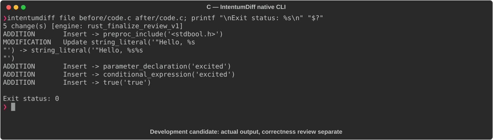

# C

[All languages](../gallery.md)

These real terminal captures use a historical development build. They are not current release certification; independent output review and current installed-wheel scenario checks remain pending.

## Overview

This worked example compares `code.c`. Advertised filename extensions: `.c`.

## What changes

Include stdbool.h; add bool excited parameter to greet and conditionally append !; update main to pass true, changing its printed greeting.

## Before

````text
#include <stdio.h>

void greet(const char *name) {
    printf("Hello, %s\n", name);
}

int main(void) {
    greet("World");
    return 0;
}
````

## After

````text
#include <stdbool.h>
#include <stdio.h>

void greet(const char *name, bool excited) {
    printf("Hello, %s%s\n", name, excited ? "!" : "");
}

int main(void) {
    greet("World", true);
    return 0;
}
````

## Things to know

- greet's callable signature changes; this is not a behavior-preserving refactor.

## Recorded output



Recorded from a real native CLI through rs-rich-record. A refactoring label does not prove equivalent behavior. [Build identities](../provenance.md).

## Scenario coverage

| Scenario | Status |
|---|---|
| Meaningful edit | Source example reviewed; output captured; independent result certification pending |
| Unchanged content | Not yet certified for this candidate |
| Populate / clear a file | Not yet certified for this candidate |
| Add / delete an entity | Not yet certified for this candidate |
| Rename a symbol | Not yet certified for this candidate |
| Move / reorder code | Not yet certified for this candidate |
| Formatting only | Not yet certified for this candidate |
| Git file rename / move | Not yet certified for this candidate |
| Mixed move and edit | Not yet certified for this candidate |
| Invalid syntax / actionable error | Not yet certified for this candidate |
| Guardrail review | Not yet certified for this candidate |

## Try it

Save the two source blocks as separate files with the shown extension, then compare them:

```bash
intentumdiff file before/code.c after/code.c
```

The installed Python wheel includes its parser components. The native CLI requires a component directory. Compare the result with the source change described above; agreement between APIs alone is not proof of correctness.
