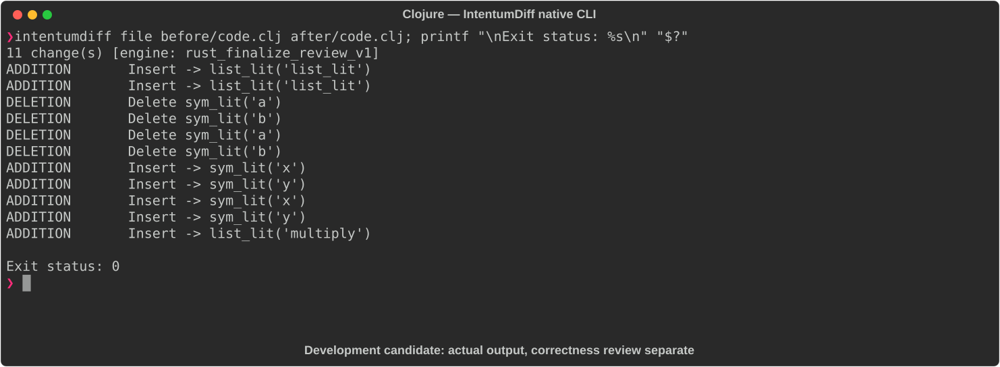

# Clojure

[All languages](../gallery.md)

These real terminal captures use a historical development build. They are not current release certification; independent output review and current installed-wheel scenario checks remain pending.

## Overview

This worked example compares `code.clj`. Advertised filename extensions: `.clj`.

## What changes

greet gains two arities with a suffix argument and default !; add renames its parameters and compacts formatting; add multiply.

## Before

````text
(defn greet [name]
  (println (str "Hello, " name)))

(defn add [a b]
  (+ a b))
````

## After

````text
(defn greet
  ([name] (greet name "!"))
  ([name suffix]
   (println (str "Hello, " name suffix))))

(defn add [x y] (+ x y))

(defn multiply [x y] (* x y))
````

## Things to know

- Single-argument greet now prints extra punctuation; new arity changes API.

- Parameter rename in add preserves its shown computation but does not establish whole-file equivalence.

## Recorded output



Recorded from a real native CLI through rs-rich-record. A refactoring label does not prove equivalent behavior. [Build identities](../provenance.md).

## Scenario coverage

| Scenario | Status |
|---|---|
| Meaningful edit | Source example reviewed; output captured; independent result certification pending |
| Unchanged content | Not yet certified for this candidate |
| Populate / clear a file | Not yet certified for this candidate |
| Add / delete an entity | Not yet certified for this candidate |
| Rename a symbol | Not yet certified for this candidate |
| Move / reorder code | Not yet certified for this candidate |
| Formatting only | Not yet certified for this candidate |
| Git file rename / move | Not yet certified for this candidate |
| Mixed move and edit | Not yet certified for this candidate |
| Invalid syntax / actionable error | Not yet certified for this candidate |
| Guardrail review | Not yet certified for this candidate |

## Try it

Save the two source blocks as separate files with the shown extension, then compare them:

```bash
intentumdiff file before/code.clj after/code.clj
```

The installed Python wheel includes its parser components. The native CLI requires a component directory. Compare the result with the source change described above; agreement between APIs alone is not proof of correctness.
