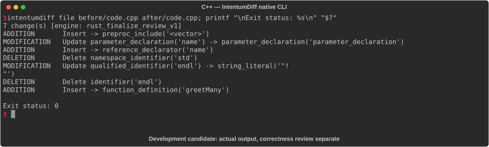

# C++

[All languages](../gallery.md)

These real terminal captures use a historical development build. They are not current release certification; independent output review and current installed-wheel scenario checks remain pending.

## Overview

This worked example compares `code.cpp`. Advertised filename extensions: `.cpp`.

## What changes

Add vector include and greetMany loop; change greet parameter to const reference; append ! and replace endl with newline in output; main remains unchanged.

## Before

````text
#include <iostream>
#include <string>

void greet(std::string name) {
    std::cout << "Hello, " + name << std::endl;
}

int main() {
    greet("World");
    return 0;
}
````

## After

````text
#include <iostream>
#include <string>
#include <vector>

void greet(const std::string& name) {
    std::cout << "Hello, " << name << "!\n";
}

void greetMany(const std::vector<std::string>& names) {
    for (const auto& name : names) greet(name);
}

int main() {
    greet("World");
    return 0;
}
````

## Things to know

- Replacing endl removes its explicit flush; punctuation and parameter signature change, so this is not purely performance/style refactoring.

## Recorded output



Recorded from a real native CLI through rs-rich-record. A refactoring label does not prove equivalent behavior. [Build identities](../provenance.md).

## Scenario coverage

| Scenario | Status |
|---|---|
| Meaningful edit | Source example reviewed; output captured; independent result certification pending |
| Unchanged content | Not yet certified for this candidate |
| Populate / clear a file | Not yet certified for this candidate |
| Add / delete an entity | Not yet certified for this candidate |
| Rename a symbol | Not yet certified for this candidate |
| Move / reorder code | Not yet certified for this candidate |
| Formatting only | Not yet certified for this candidate |
| Git file rename / move | Not yet certified for this candidate |
| Mixed move and edit | Not yet certified for this candidate |
| Invalid syntax / actionable error | Not yet certified for this candidate |
| Guardrail review | Not yet certified for this candidate |

## Try it

Save the two source blocks as separate files with the shown extension, then compare them:

```bash
intentumdiff file before/code.cpp after/code.cpp
```

The installed Python wheel includes its parser components. The native CLI requires a component directory. Compare the result with the source change described above; agreement between APIs alone is not proof of correctness.
