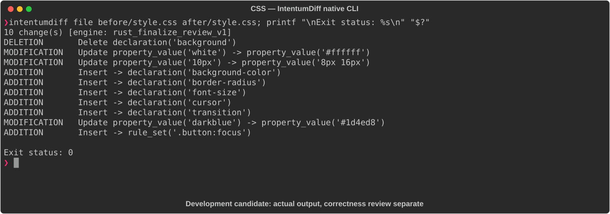

# CSS

[All languages](../gallery.md)

These real terminal captures use a historical development build. They are not current release certification; independent output review and current installed-wheel scenario checks remain pending.

## Overview

This worked example compares `style.css`. Advertised filename extensions: `.css`.

## What changes

Change normal/hover blue colors and padding; replace background shorthand with background-color; add radius, font size, cursor, transition and focus outline/offset; white becomes equivalent #ffffff.

## Before

````text
.button {
  background: blue;
  color: white;
  padding: 10px;
  border: none;
}

.button:hover {
  background: darkblue;
}
````

## After

````text
.button {
  background-color: #2563eb;
  color: #ffffff;
  padding: 8px 16px;
  border: none;
  border-radius: 6px;
  font-size: 14px;
  cursor: pointer;
  transition: background-color 0.2s ease;
}

.button:hover {
  background-color: #1d4ed8;
}

.button:focus {
  outline: 2px solid #93c5fd;
  outline-offset: 2px;
}
````

## Things to know

- New blue hex values are not equivalent to old blue/darkblue.

- Shorthand-to-longhand replacement can change reset/cascade behavior beyond the color itself.

## Recorded output



Recorded from a real native CLI through rs-rich-record. A refactoring label does not prove equivalent behavior. [Build identities](../provenance.md).

## Scenario coverage

| Scenario | Status |
|---|---|
| Meaningful edit | Source example reviewed; output captured; independent result certification pending |
| Unchanged content | Not yet certified for this candidate |
| Populate / clear a file | Not yet certified for this candidate |
| Add / delete an entity | Not yet certified for this candidate |
| Rename a symbol | Not yet certified for this candidate |
| Move / reorder code | Not yet certified for this candidate |
| Formatting only | Not yet certified for this candidate |
| Git file rename / move | Not yet certified for this candidate |
| Mixed move and edit | Not yet certified for this candidate |
| Invalid syntax / actionable error | Not yet certified for this candidate |
| Guardrail review | Not yet certified for this candidate |

## Try it

Save the two source blocks as separate files with the shown extension, then compare them:

```bash
intentumdiff file before/style.css after/style.css
```

The installed Python wheel includes its parser components. The native CLI requires a component directory. Compare the result with the source change described above; agreement between APIs alone is not proof of correctness.
