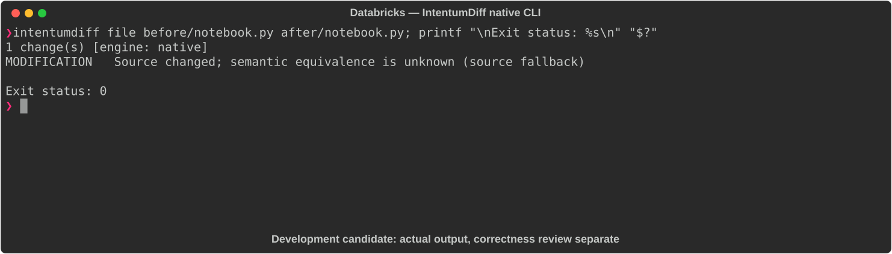

# Databricks

[All languages](../gallery.md)

These real terminal captures use a historical development build. They are not current release certification; independent output review and current installed-wheel scenario checks remain pending.

## Overview

This worked example compares `notebook.py`. Advertised filename extensions: `.py`, `.sql`.

## What changes

As workflow YAML, add env parameter default prod and transform notebook task depending on ingest; preserve ingest task and etl_job name.

## Before

````text
name: etl_job
tasks:
  - task_key: ingest
    notebook_task:
      notebook_path: /notebooks/ingest
````

## After

````text
name: etl_job
parameters:
  - name: env
    default: prod
tasks:
  - task_key: ingest
    notebook_task:
      notebook_path: /notebooks/ingest
  - task_key: transform
    depends_on:
      - task_key: ingest
    notebook_task:
      notebook_path: /notebooks/transform
````

## Things to know

- Content is YAML workflow configuration, not Python notebook source despite filename notebook.py and language databricks.

- Same source pair appears under databricks-workflow; routing must be investigated before counting this as notebook-language correctness evidence.

## Recorded output



Recorded from a real native CLI through rs-rich-record. A refactoring label does not prove equivalent behavior. [Build identities](../provenance.md).

## Scenario coverage

| Scenario | Status |
|---|---|
| Meaningful edit | Source example reviewed; output captured; independent result certification pending |
| Unchanged content | Not yet certified for this candidate |
| Populate / clear a file | Not yet certified for this candidate |
| Add / delete an entity | Not yet certified for this candidate |
| Rename a symbol | Not yet certified for this candidate |
| Move / reorder code | Not yet certified for this candidate |
| Formatting only | Not yet certified for this candidate |
| Git file rename / move | Not yet certified for this candidate |
| Mixed move and edit | Not yet certified for this candidate |
| Invalid syntax / actionable error | Not yet certified for this candidate |
| Guardrail review | Not yet certified for this candidate |

## Try it

Save the two source blocks as separate files with the shown extension, then compare them:

```bash
intentumdiff file before/notebook.py after/notebook.py
```

The installed Python wheel includes its parser components. The native CLI requires a component directory. Compare the result with the source change described above; agreement between APIs alone is not proof of correctness.
