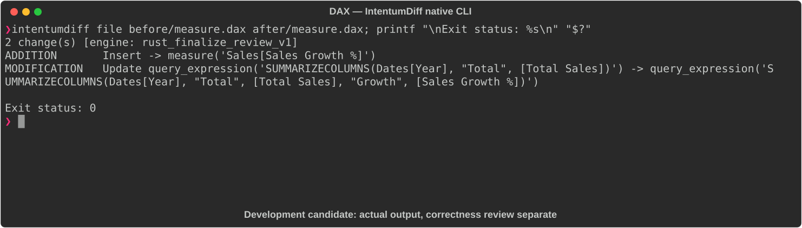

# DAX

[All languages](../gallery.md)

These real terminal captures use a historical development build. They are not current release certification; independent output review and current installed-wheel scenario checks remain pending.

## Overview

This worked example compares `measure.dax`. Advertised filename extensions: `.dax`.

## What changes

Add Sales Growth % measure dividing current-minus-prior-year sales by prior-year sales; include Growth in SUMMARIZECOLUMNS output; retain Total Sales and Sales YTD measures.

## Before

````text
DEFINE
MEASURE Sales[Total Sales] = SUM(Sales[Amount])
MEASURE Sales[Sales YTD] =
    TOTALYTD(SUM(Sales[Amount]), Dates[Date])

EVALUATE
SUMMARIZECOLUMNS(Dates[Year], "Total", [Total Sales])
````

## After

````text
DEFINE
MEASURE Sales[Total Sales] = SUM(Sales[Amount])
MEASURE Sales[Sales YTD] =
    TOTALYTD(SUM(Sales[Amount]), Dates[Date])
MEASURE Sales[Sales Growth %] =
    DIVIDE([Total Sales] - CALCULATE([Total Sales], SAMEPERIODLASTYEAR(Dates[Date])),
           CALCULATE([Total Sales], SAMEPERIODLASTYEAR(Dates[Date])))

EVALUATE
SUMMARIZECOLUMNS(Dates[Year], "Total", [Total Sales], "Growth", [Sales Growth %])
````

## Things to know

- Requires the referenced Sales/Dates model and relationships; time-intelligence behavior cannot be established from the query alone.

## Recorded output



Recorded from a real native CLI through rs-rich-record. A refactoring label does not prove equivalent behavior. [Build identities](../provenance.md).

## Scenario coverage

| Scenario | Status |
|---|---|
| Meaningful edit | Source example reviewed; output captured; independent result certification pending |
| Unchanged content | Not yet certified for this candidate |
| Populate / clear a file | Not yet certified for this candidate |
| Add / delete an entity | Not yet certified for this candidate |
| Rename a symbol | Not yet certified for this candidate |
| Move / reorder code | Not yet certified for this candidate |
| Formatting only | Not yet certified for this candidate |
| Git file rename / move | Not yet certified for this candidate |
| Mixed move and edit | Not yet certified for this candidate |
| Invalid syntax / actionable error | Not yet certified for this candidate |
| Guardrail review | Not yet certified for this candidate |

## Try it

Save the two source blocks as separate files with the shown extension, then compare them:

```bash
intentumdiff file before/measure.dax after/measure.dax
```

The installed Python wheel includes its parser components. The native CLI requires a component directory. Compare the result with the source change described above; agreement between APIs alone is not proof of correctness.
