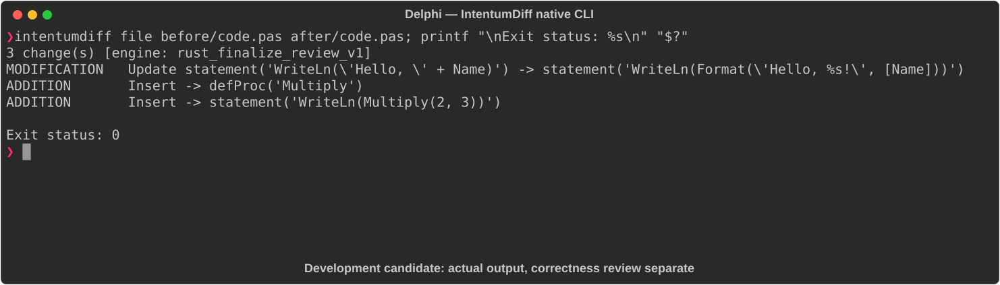

# Delphi

[All languages](../gallery.md)

These real terminal captures use a historical development build. They are not current release certification; independent output review and current installed-wheel scenario checks remain pending.

## Overview

This worked example compares `code.pas`. Advertised filename extensions: `.pas`.

## What changes

Greet switches to Format and adds !; Add parameters become const; add Multiply with const integer inputs and print Multiply(2,3) in the program body.

## Before

````text
program Demo;

procedure Greet(const Name: string);
begin
  WriteLn('Hello, ' + Name);
end;

function Add(A, B: Integer): Integer;
begin
  Result := A + B;
end;

begin
  Greet('World');
  WriteLn(Add(2, 3));
end.
````

## After

````text
program Demo;

procedure Greet(const Name: string);
begin
  WriteLn(Format('Hello, %s!', [Name]));
end;

function Add(const A, B: Integer): Integer;
begin
  Result := A + B;
end;

function Multiply(const A, B: Integer): Integer;
begin
  Result := A * B;
end;

begin
  Greet('World');
  WriteLn(Add(2, 3));
  WriteLn(Multiply(2, 3));
end.
````

## Things to know

- New source calls Format without a uses SysUtils clause; ordinary standalone Delphi compilation needs its declaration/import.

- Additional printed result and greeting punctuation are meaningful; do not classify the whole change as safe refactoring.

## Recorded output



Recorded from a real native CLI through rs-rich-record. A refactoring label does not prove equivalent behavior. [Build identities](../provenance.md).

## Scenario coverage

| Scenario | Status |
|---|---|
| Meaningful edit | Source example reviewed; output captured; independent result certification pending |
| Unchanged content | Not yet certified for this candidate |
| Populate / clear a file | Not yet certified for this candidate |
| Add / delete an entity | Not yet certified for this candidate |
| Rename a symbol | Not yet certified for this candidate |
| Move / reorder code | Not yet certified for this candidate |
| Formatting only | Not yet certified for this candidate |
| Git file rename / move | Not yet certified for this candidate |
| Mixed move and edit | Not yet certified for this candidate |
| Invalid syntax / actionable error | Not yet certified for this candidate |
| Guardrail review | Not yet certified for this candidate |

## Try it

Save the two source blocks as separate files with the shown extension, then compare them:

```bash
intentumdiff file before/code.pas after/code.pas
```

The installed Python wheel includes its parser components. The native CLI requires a component directory. Compare the result with the source change described above; agreement between APIs alone is not proof of correctness.
