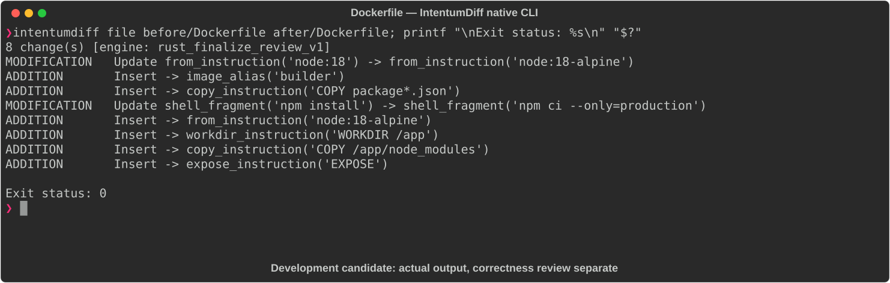

# Dockerfile

[All languages](../gallery.md)

These real terminal captures use a historical development build. They are not current release certification; independent output review and current installed-wheel scenario checks remain pending.

## Overview

This worked example compares `Dockerfile`. Advertised filename extensions: `Dockerfile`.

## What changes

Replace node:18 single stage with two node:18-alpine stages; install production dependencies with npm ci from package manifests in builder, copy node_modules into final stage, copy source, and add EXPOSE 3000; retain workdir and CMD.

## Before

````text
FROM node:18
WORKDIR /app
COPY . .
RUN npm install
CMD ["node", "index.js"]
````

## After

````text
FROM node:18-alpine AS builder
WORKDIR /app
COPY package*.json ./
RUN npm ci --only=production

FROM node:18-alpine
WORKDIR /app
COPY --from=builder /app/node_modules ./node_modules
COPY . .
EXPOSE 3000
CMD ["node", "index.js"]
````

## Things to know

- Base OS and dependency installation semantics change; npm ci requires a compatible lockfile.

- COPY . . can copy local node_modules unless excluded; no .dockerignore is supplied.

- EXPOSE declares metadata and does not itself publish a port.

## Recorded output



Recorded from a real native CLI through rs-rich-record. A refactoring label does not prove equivalent behavior. [Build identities](../provenance.md).

## Scenario coverage

| Scenario | Status |
|---|---|
| Meaningful edit | Source example reviewed; output captured; independent result certification pending |
| Unchanged content | Not yet certified for this candidate |
| Populate / clear a file | Not yet certified for this candidate |
| Add / delete an entity | Not yet certified for this candidate |
| Rename a symbol | Not yet certified for this candidate |
| Move / reorder code | Not yet certified for this candidate |
| Formatting only | Not yet certified for this candidate |
| Git file rename / move | Not yet certified for this candidate |
| Mixed move and edit | Not yet certified for this candidate |
| Invalid syntax / actionable error | Not yet certified for this candidate |
| Guardrail review | Not yet certified for this candidate |

## Try it

Save the two source blocks as separate files with the shown extension, then compare them:

```bash
intentumdiff file before/Dockerfile after/Dockerfile
```

The installed Python wheel includes its parser components. The native CLI requires a component directory. Compare the result with the source change described above; agreement between APIs alone is not proof of correctness.
