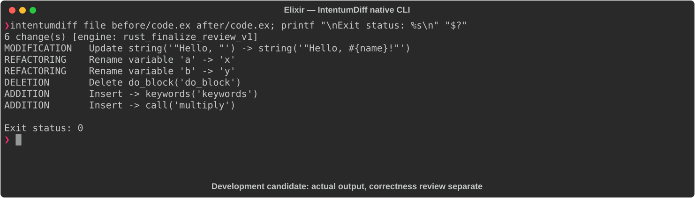

# Elixir

[All languages](../gallery.md)

These real terminal captures use a historical development build. They are not current release certification; independent output review and current installed-wheel scenario checks remain pending.

## Overview

This worked example compares `code.ex`. Advertised filename extensions: `.ex`.

## What changes

greet switches from concatenation to interpolation with !; add renames parameters and uses shorthand syntax; add multiply.

## Before

````text
defmodule Greeter do
  def greet(name) do
    IO.puts("Hello, " <> name)
  end

  def add(a, b) do
    a + b
  end
end
````

## After

````text
defmodule Greeter do
  def greet(name) do
    IO.puts("Hello, #{name}!")
  end

  def add(x, y), do: x + y

  def multiply(x, y), do: x * y
end
````

## Things to know

- Interpolation and binary concatenation can accept different input types; greet is not necessarily equivalent apart from punctuation.

## Recorded output



Recorded from a real native CLI through rs-rich-record. A refactoring label does not prove equivalent behavior. [Build identities](../provenance.md).

## Scenario coverage

| Scenario | Status |
|---|---|
| Meaningful edit | Source example reviewed; output captured; independent result certification pending |
| Unchanged content | Not yet certified for this candidate |
| Populate / clear a file | Not yet certified for this candidate |
| Add / delete an entity | Not yet certified for this candidate |
| Rename a symbol | Not yet certified for this candidate |
| Move / reorder code | Not yet certified for this candidate |
| Formatting only | Not yet certified for this candidate |
| Git file rename / move | Not yet certified for this candidate |
| Mixed move and edit | Not yet certified for this candidate |
| Invalid syntax / actionable error | Not yet certified for this candidate |
| Guardrail review | Not yet certified for this candidate |

## Try it

Save the two source blocks as separate files with the shown extension, then compare them:

```bash
intentumdiff file before/code.ex after/code.ex
```

The installed Python wheel includes its parser components. The native CLI requires a component directory. Compare the result with the source change described above; agreement between APIs alone is not proof of correctness.
