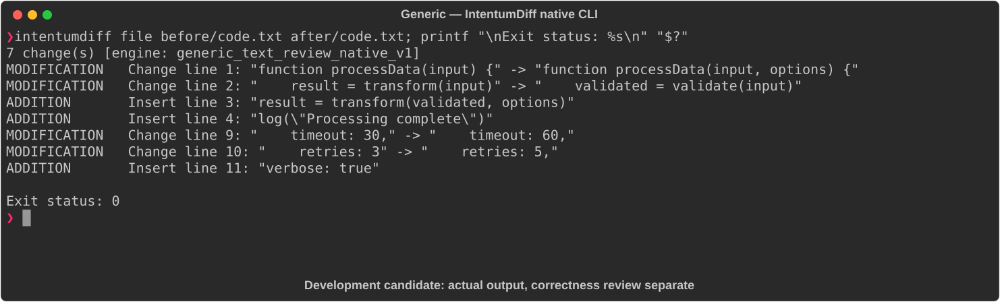

# Generic

[All languages](../gallery.md)

These real terminal captures use a historical development build. They are not current release certification; independent output review and current installed-wheel scenario checks remain pending.

## Overview

This worked example compares `code.txt`. Advertised filename extensions: `.txt`.

## What changes

Add options parameter, validate input before transform, pass options to transform and log completion; change timeout 30 to 60 and retries 3 to 5; add verbose=true.

## Before

````text
function processData(input) {
    result = transform(input)
    return result
}

config = {
    timeout: 30,
    retries: 3
}
````

## After

````text
function processData(input, options) {
    validated = validate(input)
    result = transform(validated, options)
    log("Processing complete")
    return result
}

config = {
    timeout: 60,
    retries: 5,
    verbose: true
}
````

## Things to know

- JavaScript-like pseudocode in .txt; no parser-specific validity or execution semantics should be claimed.

- All listed behavioral-looking changes must remain visible in text review.

- Cold native selection took over two minutes in one measured run. [Tracked performance issue](https://github.com/buchochelliq-labs/intentumdiff-core/issues/155).

## Recorded output



Recorded from a real native CLI through rs-rich-record. A refactoring label does not prove equivalent behavior. [Build identities](../provenance.md).

## Scenario coverage

| Scenario | Status |
|---|---|
| Meaningful edit | Source example reviewed; output captured; independent result certification pending |
| Unchanged content | Not yet certified for this candidate |
| Populate / clear a file | Not yet certified for this candidate |
| Add / delete an entity | Not yet certified for this candidate |
| Rename a symbol | Not yet certified for this candidate |
| Move / reorder code | Not yet certified for this candidate |
| Formatting only | Not yet certified for this candidate |
| Git file rename / move | Not yet certified for this candidate |
| Mixed move and edit | Not yet certified for this candidate |
| Invalid syntax / actionable error | Not yet certified for this candidate |
| Guardrail review | Not yet certified for this candidate |

## Try it

Save the two source blocks as separate files with the shown extension, then compare them:

```bash
intentumdiff file before/code.txt after/code.txt
```

The installed Python wheel includes its parser components. The native CLI requires a component directory. Compare the result with the source change described above; agreement between APIs alone is not proof of correctness.
