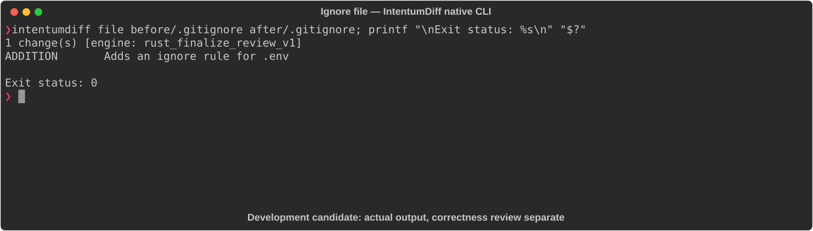

# Ignore file

[All languages](../gallery.md)

These real terminal captures use a historical development build. They are not current release certification; independent output review and current installed-wheel scenario checks remain pending.

## Overview

This worked example compares `.gitignore`. Advertised filename extensions: `.gitignore`, `.dockerignore`, `.npmignore`, `.eslintignore`, `.prettierignore`, `.helmignore`, `.gcloudignore`.

## What changes

Add .env ignore pattern; preserve existing target, node_modules and log patterns.

## Before

````text
# Build output
/target
node_modules/

*.log
````

## After

````text
# Build output
/target
node_modules/

*.log
.env
````

## Things to know

- Ignore rules affect untracked-path matching, not removal of already tracked files; this is not just a comment/style addition.

## Recorded output



Recorded from a real native CLI through rs-rich-record. A refactoring label does not prove equivalent behavior. [Build identities](../provenance.md).

## Scenario coverage

| Scenario | Status |
|---|---|
| Meaningful edit | Source example reviewed; output captured; independent result certification pending |
| Unchanged content | Not yet certified for this candidate |
| Populate / clear a file | Not yet certified for this candidate |
| Add / delete an entity | Not yet certified for this candidate |
| Rename a symbol | Not yet certified for this candidate |
| Move / reorder code | Not yet certified for this candidate |
| Formatting only | Not yet certified for this candidate |
| Git file rename / move | Not yet certified for this candidate |
| Mixed move and edit | Not yet certified for this candidate |
| Invalid syntax / actionable error | Not yet certified for this candidate |
| Guardrail review | Not yet certified for this candidate |

## Try it

Save the two source blocks as separate files with the shown extension, then compare them:

```bash
intentumdiff file before/.gitignore after/.gitignore
```

The installed Python wheel includes its parser components. The native CLI requires a component directory. Compare the result with the source change described above; agreement between APIs alone is not proof of correctness.
