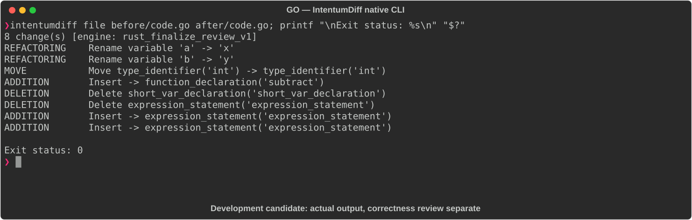

# GO

[All languages](../gallery.md)

These real terminal captures use a historical development build. They are not current release certification; independent output review and current installed-wheel scenario checks remain pending.

## Overview

This worked example compares `code.go`. Advertised filename extensions: `.go`.

## What changes

Rename add parameters without changing its sum; add subtract; inline add call into first Println and add a second Println for subtract(10,3).

## Before

````text
package main

import "fmt"

func add(a, b int) int {
	return a + b
}

func main() {
	result := add(3, 4)
	fmt.Println(result)
}
````

## After

````text
package main

import "fmt"

func add(x, y int) int {
	return x + y
}

func subtract(x, y int) int {
	return x - y
}

func main() {
	fmt.Println(add(3, 4))
	fmt.Println(subtract(10, 3))
}
````

## Things to know

- Program adds a second output line; whole-program equivalence is false even though the temporary removal preserves the first result.

## Recorded output



Recorded from a real native CLI through rs-rich-record. A refactoring label does not prove equivalent behavior. [Build identities](../provenance.md).

## Scenario coverage

| Scenario | Status |
|---|---|
| Meaningful edit | Source example reviewed; output captured; independent result certification pending |
| Unchanged content | Not yet certified for this candidate |
| Populate / clear a file | Not yet certified for this candidate |
| Add / delete an entity | Not yet certified for this candidate |
| Rename a symbol | Not yet certified for this candidate |
| Move / reorder code | Not yet certified for this candidate |
| Formatting only | Not yet certified for this candidate |
| Git file rename / move | Not yet certified for this candidate |
| Mixed move and edit | Not yet certified for this candidate |
| Invalid syntax / actionable error | Not yet certified for this candidate |
| Guardrail review | Not yet certified for this candidate |

## Try it

Save the two source blocks as separate files with the shown extension, then compare them:

```bash
intentumdiff file before/code.go after/code.go
```

The installed Python wheel includes its parser components. The native CLI requires a component directory. Compare the result with the source change described above; agreement between APIs alone is not proof of correctness.
