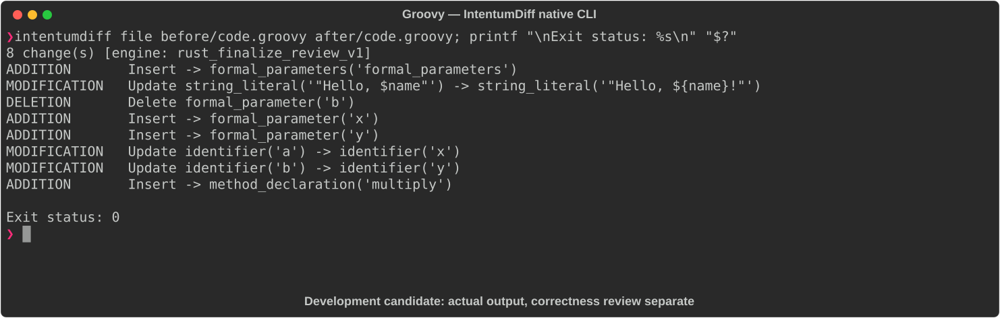

# Groovy

[All languages](../gallery.md)

These real terminal captures use a historical development build. They are not current release certification; independent output review and current installed-wheel scenario checks remain pending.

## Overview

This worked example compares `code.groovy`. Advertised filename extensions: `.groovy`.

## What changes

Constrain greet name to String and append !; change add to int inputs/return and rename parameters; add typed multiply.

## Before

````text
def greet(name) {
    println "Hello, $name"
}

def add(a, b) {
    return a + b
}
````

## After

````text
def greet(String name) {
    println "Hello, ${name}!"
}

int add(int x, int y) {
    return x + y
}

int multiply(int x, int y) {
    return x * y
}
````

## Things to know

- Dynamic-to-int typing restricts accepted inputs and return/coercion behavior; it is not merely parameter renaming.

## Recorded output



Recorded from a real native CLI through rs-rich-record. A refactoring label does not prove equivalent behavior. [Build identities](../provenance.md).

## Scenario coverage

| Scenario | Status |
|---|---|
| Meaningful edit | Source example reviewed; output captured; independent result certification pending |
| Unchanged content | Not yet certified for this candidate |
| Populate / clear a file | Not yet certified for this candidate |
| Add / delete an entity | Not yet certified for this candidate |
| Rename a symbol | Not yet certified for this candidate |
| Move / reorder code | Not yet certified for this candidate |
| Formatting only | Not yet certified for this candidate |
| Git file rename / move | Not yet certified for this candidate |
| Mixed move and edit | Not yet certified for this candidate |
| Invalid syntax / actionable error | Not yet certified for this candidate |
| Guardrail review | Not yet certified for this candidate |

## Try it

Save the two source blocks as separate files with the shown extension, then compare them:

```bash
intentumdiff file before/code.groovy after/code.groovy
```

The installed Python wheel includes its parser components. The native CLI requires a component directory. Compare the result with the source change described above; agreement between APIs alone is not proof of correctness.
