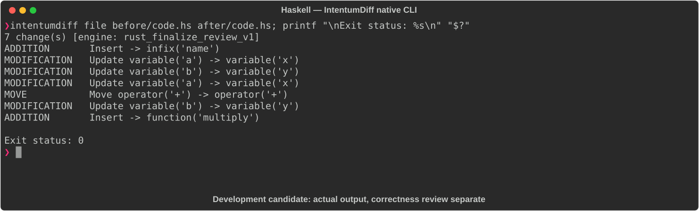

# Haskell

[All languages](../gallery.md)

These real terminal captures use a historical development build. They are not current release certification; independent output review and current installed-wheel scenario checks remain pending.

## Overview

This worked example compares `code.hs`. Advertised filename extensions: `.hs`.

## What changes

Append ! to greet result; rename add parameters with the same Int sum; add multiply signature and implementation.

## Before

````text
greet :: String -> String
greet name = "Hello, " ++ name

add :: Int -> Int -> Int
add a b = a + b
````

## After

````text
greet :: String -> String
greet name = "Hello, " ++ name ++ "!"

add :: Int -> Int -> Int
add x y = x + y

multiply :: Int -> Int -> Int
multiply x y = x * y
````

## Things to know

- Library-style fragment has no main; do not require executable completeness to judge the source edits.

## Recorded output



Recorded from a real native CLI through rs-rich-record. A refactoring label does not prove equivalent behavior. [Build identities](../provenance.md).

## Scenario coverage

| Scenario | Status |
|---|---|
| Meaningful edit | Source example reviewed; output captured; independent result certification pending |
| Unchanged content | Not yet certified for this candidate |
| Populate / clear a file | Not yet certified for this candidate |
| Add / delete an entity | Not yet certified for this candidate |
| Rename a symbol | Not yet certified for this candidate |
| Move / reorder code | Not yet certified for this candidate |
| Formatting only | Not yet certified for this candidate |
| Git file rename / move | Not yet certified for this candidate |
| Mixed move and edit | Not yet certified for this candidate |
| Invalid syntax / actionable error | Not yet certified for this candidate |
| Guardrail review | Not yet certified for this candidate |

## Try it

Save the two source blocks as separate files with the shown extension, then compare them:

```bash
intentumdiff file before/code.hs after/code.hs
```

The installed Python wheel includes its parser components. The native CLI requires a component directory. Compare the result with the source change described above; agreement between APIs alone is not proof of correctness.
