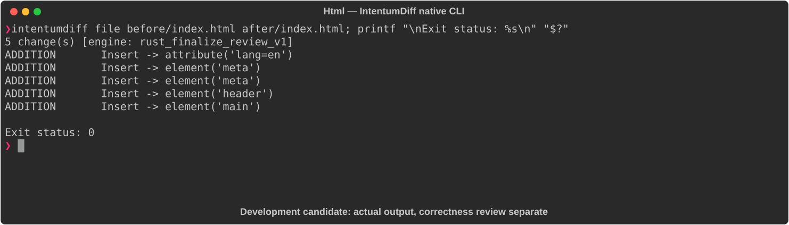

# Html

[All languages](../gallery.md)

These real terminal captures use a historical development build. They are not current release certification; independent output review and current installed-wheel scenario checks remain pending.

## Overview

This worked example compares `index.html`. Advertised filename extensions: `.html`, `.htm`.

## What changes

Add html lang=en, charset and viewport metadata; wrap existing heading in header and paragraph in main; retain title and visible text.

## Before

````text
<!DOCTYPE html>
<html>
<head>
  <title>My Page</title>
</head>
<body>
  <h1>Hello World</h1>
  <p>Welcome to my site.</p>
</body>
</html>
````

## After

````text
<!DOCTYPE html>
<html lang="en">
<head>
  <meta charset="UTF-8">
  <meta name="viewport" content="width=device-width, initial-scale=1.0">
  <title>My Page</title>
</head>
<body>
  <header>
    <h1>Hello World</h1>
  </header>
  <main>
    <p>Welcome to my site.</p>
  </main>
</body>
</html>
````

## Things to know

- Structural/accessibility and viewport changes are meaningful even though visible text is unchanged.

## Recorded output



Recorded from a real native CLI through rs-rich-record. A refactoring label does not prove equivalent behavior. [Build identities](../provenance.md).

## Scenario coverage

| Scenario | Status |
|---|---|
| Meaningful edit | Source example reviewed; output captured; independent result certification pending |
| Unchanged content | Not yet certified for this candidate |
| Populate / clear a file | Not yet certified for this candidate |
| Add / delete an entity | Not yet certified for this candidate |
| Rename a symbol | Not yet certified for this candidate |
| Move / reorder code | Not yet certified for this candidate |
| Formatting only | Not yet certified for this candidate |
| Git file rename / move | Not yet certified for this candidate |
| Mixed move and edit | Not yet certified for this candidate |
| Invalid syntax / actionable error | Not yet certified for this candidate |
| Guardrail review | Not yet certified for this candidate |

## Try it

Save the two source blocks as separate files with the shown extension, then compare them:

```bash
intentumdiff file before/index.html after/index.html
```

The installed Python wheel includes its parser components. The native CLI requires a component directory. Compare the result with the source change described above; agreement between APIs alone is not proof of correctness.
