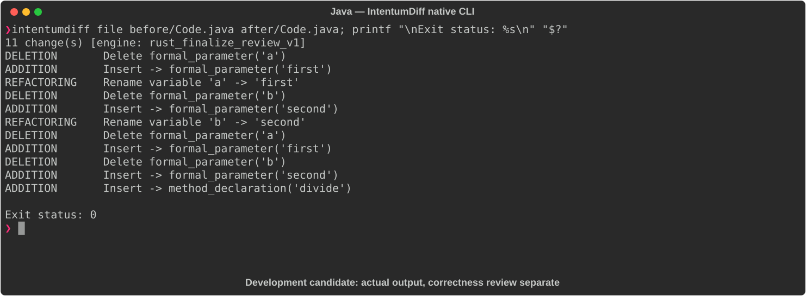

# Java

[All languages](../gallery.md)

These real terminal captures use a historical development build. They are not current release certification; independent output review and current installed-wheel scenario checks remain pending.

## Overview

This worked example compares `Code.java`. Advertised filename extensions: `.java`.

## What changes

Rename add/multiply parameters while preserving arithmetic; add double-returning divide with explicit zero-divisor ArithmeticException and a cast enabling noninteger division.

## Before

````text
public class Calculator {
    public int add(int a, int b) {
        return a + b;
    }

    public int multiply(int a, int b) {
        return a * b;
    }
}
````

## After

````text
public class Calculator {
    public int add(int first, int second) {
        return first + second;
    }

    public int multiply(int first, int second) {
        return first * second;
    }

    public double divide(int dividend, int divisor) {
        if (divisor == 0) throw new ArithmeticException("Division by zero");
        return (double) dividend / divisor;
    }
}
````

## Things to know

- Filename Code.java does not match public class Calculator; standalone javac compilation normally requires Calculator.java.

- Parameter names may be observable through metadata, but new divide API is the main functional addition.

## Recorded output



Recorded from a real native CLI through rs-rich-record. A refactoring label does not prove equivalent behavior. [Build identities](../provenance.md).

## Scenario coverage

| Scenario | Status |
|---|---|
| Meaningful edit | Source example reviewed; output captured; independent result certification pending |
| Unchanged content | Not yet certified for this candidate |
| Populate / clear a file | Not yet certified for this candidate |
| Add / delete an entity | Not yet certified for this candidate |
| Rename a symbol | Not yet certified for this candidate |
| Move / reorder code | Not yet certified for this candidate |
| Formatting only | Not yet certified for this candidate |
| Git file rename / move | Not yet certified for this candidate |
| Mixed move and edit | Not yet certified for this candidate |
| Invalid syntax / actionable error | Not yet certified for this candidate |
| Guardrail review | Not yet certified for this candidate |

## Try it

Save the two source blocks as separate files with the shown extension, then compare them:

```bash
intentumdiff file before/Code.java after/Code.java
```

The installed Python wheel includes its parser components. The native CLI requires a component directory. Compare the result with the source change described above; agreement between APIs alone is not proof of correctness.
