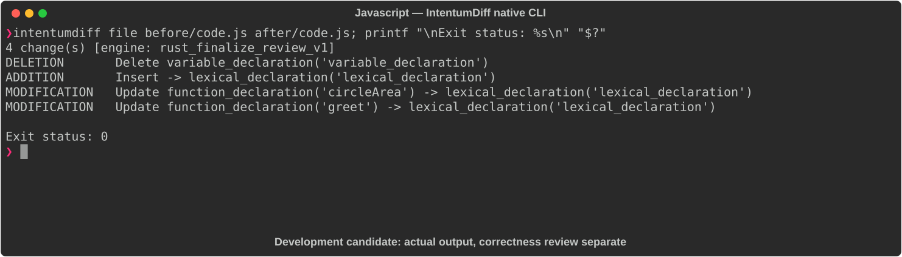
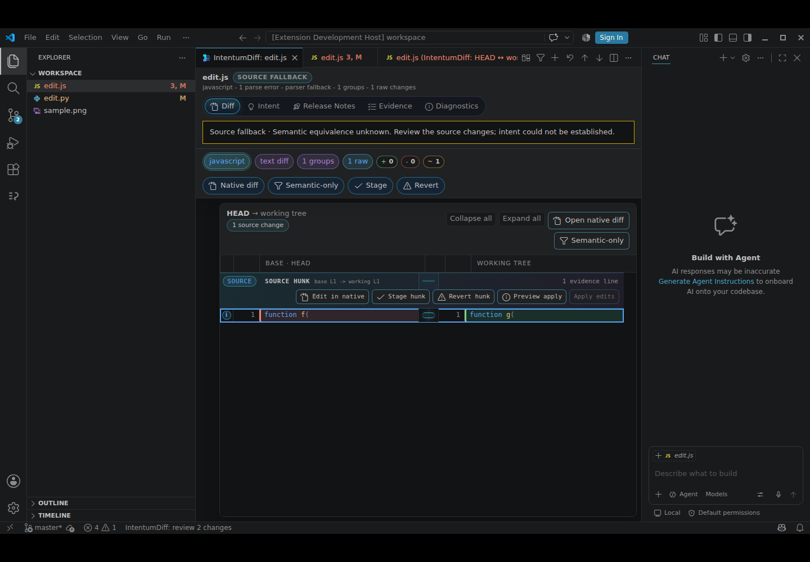

# Javascript

[All languages](../gallery.md)

These real terminal captures use a historical development build. They are not current release certification; independent output review and current installed-wheel scenario checks remain pending.

## Overview

This worked example compares `code.js`. Advertised filename extensions: `.js`, `.mjs`, `.cjs`, `.jsx`.

## What changes

Change PI from var to const; replace circleArea and greet declarations with const arrow functions; reassociate area arithmetic to PI*(radius**2) and use template interpolation for greeting; preserve export names.

## Before

````text
var PI = 3.14159;

function circleArea(radius) {
  return PI * radius * radius;
}

function greet(name) {
  return "Hello, " + name + "!";
}

module.exports = { circleArea, greet };
````

## After

````text
const PI = 3.14159;

const circleArea = (radius) => PI * radius ** 2;

const greet = (name) => `Hello, ${name}!`;

module.exports = { circleArea, greet };
````

## Things to know

- Do not label all edits safe: arithmetic reassociation can change floating-point results.

- Arrow functions differ in constructibility/prototype and binding/hoisting behavior; const changes reassignment and initialization semantics.

- String concatenation versus template interpolation can differ for unusual coercion inputs.

## Recorded output



Recorded from a real native CLI through rs-rich-record. A refactoring label does not prove equivalent behavior. [Build identities](../provenance.md).

## Scenario coverage

| Scenario | Status |
|---|---|
| Meaningful edit | Source example reviewed; output captured; independent result certification pending |
| Unchanged content | Not yet certified for this candidate |
| Populate / clear a file | Not yet certified for this candidate |
| Add / delete an entity | Not yet certified for this candidate |
| Rename a symbol | Not yet certified for this candidate |
| Move / reorder code | Not yet certified for this candidate |
| Formatting only | Not yet certified for this candidate |
| Git file rename / move | Not yet certified for this candidate |
| Mixed move and edit | Not yet certified for this candidate |
| Invalid syntax / actionable error | Not yet certified for this candidate |
| Guardrail review | Not yet certified for this candidate |

## Try it

Save the two source blocks as separate files with the shown extension, then compare them:

```bash
intentumdiff file before/code.js after/code.js
```

The installed Python wheel includes its parser components. The native CLI requires a component directory. Compare the result with the source change described above; agreement between APIs alone is not proof of correctness.

## VS Code incomplete edit

This deliberately incomplete JavaScript example changes `function f(` to `function g(`.
The identifier changes, but neither input is a complete declaration. The expected result is
an explicit source fallback with parse errors, not a claim of semantic equivalence or a
style-only change.



The current installed-VSIX capture shows the source change and “semantic equivalence unknown”.
See [VS Code capabilities](../../vscode.md) and [capture provenance](../../vscode-evidence.md).
Additional VS Code captures for additions, deletions, refactors and file moves remain pending.
