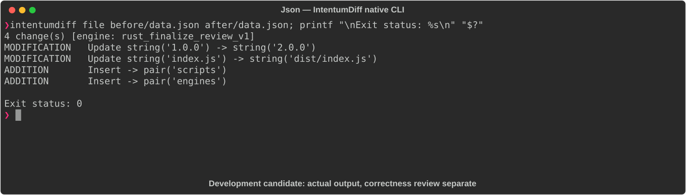

# Json

[All languages](../gallery.md)

These real terminal captures use a historical development build. They are not current release certification; independent output review and current installed-wheel scenario checks remain pending.

## Overview

This worked example compares `data.json`. Advertised filename extensions: `.json`.

## What changes

Change version 1.0.0 to 2.0.0 and main index.js to dist/index.js; add build/start scripts and engines.node >=18; preserve name.

## Before

````text
{
  "name": "my-app",
  "version": "1.0.0",
  "main": "index.js"
}
````

## After

````text
{
  "name": "my-app",
  "version": "2.0.0",
  "main": "dist/index.js",
  "scripts": {
    "build": "tsc",
    "start": "node dist/index.js"
  },
  "engines": {
    "node": ">=18"
  }
}
````

## Things to know

- Package-like JSON is named data.json; syntactic JSON correctness does not establish package-manager behavior or existence of build files.

## Recorded output



Recorded from a real native CLI through rs-rich-record. A refactoring label does not prove equivalent behavior. [Build identities](../provenance.md).

## Scenario coverage

| Scenario | Status |
|---|---|
| Meaningful edit | Source example reviewed; output captured; independent result certification pending |
| Unchanged content | Not yet certified for this candidate |
| Populate / clear a file | Not yet certified for this candidate |
| Add / delete an entity | Not yet certified for this candidate |
| Rename a symbol | Not yet certified for this candidate |
| Move / reorder code | Not yet certified for this candidate |
| Formatting only | Not yet certified for this candidate |
| Git file rename / move | Not yet certified for this candidate |
| Mixed move and edit | Not yet certified for this candidate |
| Invalid syntax / actionable error | Not yet certified for this candidate |
| Guardrail review | Not yet certified for this candidate |

## Try it

Save the two source blocks as separate files with the shown extension, then compare them:

```bash
intentumdiff file before/data.json after/data.json
```

The installed Python wheel includes its parser components. The native CLI requires a component directory. Compare the result with the source change described above; agreement between APIs alone is not proof of correctness.
