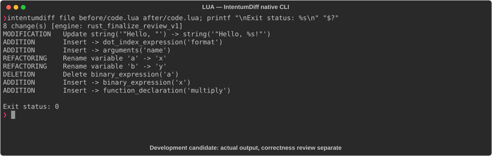

# LUA

[All languages](../gallery.md)

These real terminal captures use a historical development build. They are not current release certification; independent output review and current installed-wheel scenario checks remain pending.

## Overview

This worked example compares `code.lua`. Advertised filename extensions: `.lua`.

## What changes

Change greet and add from global to local functions; greeting uses string.format and adds !; rename add inputs; add local multiply.

## Before

````text
function greet(name)
    print("Hello, " .. name)
end

function add(a, b)
    return a + b
end
````

## After

````text
local function greet(name)
    print(string.format("Hello, %s!", name))
end

local function add(x, y)
    return x + y
end

local function multiply(x, y)
    return x * y
end
````

## Things to know

- Global-to-local scope removes the previous global API; with no exports/calls the new helpers are inaccessible outside this chunk.

- Formatting versus concatenation can differ in accepted/coerced argument types; not a safe style-only rewrite.

## Recorded output



Recorded from a real native CLI through rs-rich-record. A refactoring label does not prove equivalent behavior. [Build identities](../provenance.md).

## Scenario coverage

| Scenario | Status |
|---|---|
| Meaningful edit | Source example reviewed; output captured; independent result certification pending |
| Unchanged content | Not yet certified for this candidate |
| Populate / clear a file | Not yet certified for this candidate |
| Add / delete an entity | Not yet certified for this candidate |
| Rename a symbol | Not yet certified for this candidate |
| Move / reorder code | Not yet certified for this candidate |
| Formatting only | Not yet certified for this candidate |
| Git file rename / move | Not yet certified for this candidate |
| Mixed move and edit | Not yet certified for this candidate |
| Invalid syntax / actionable error | Not yet certified for this candidate |
| Guardrail review | Not yet certified for this candidate |

## Try it

Save the two source blocks as separate files with the shown extension, then compare them:

```bash
intentumdiff file before/code.lua after/code.lua
```

The installed Python wheel includes its parser components. The native CLI requires a component directory. Compare the result with the source change described above; agreement between APIs alone is not proof of correctness.
