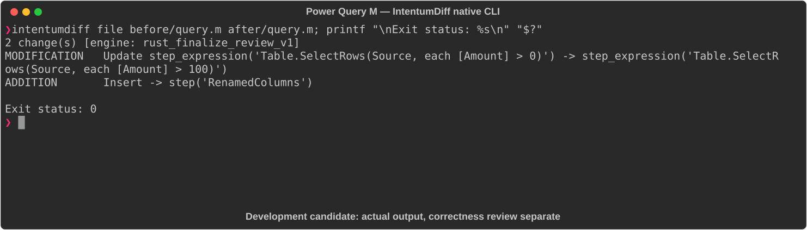

# Power Query M

[All languages](../gallery.md)

These real terminal captures use a historical development build. They are not current release certification; independent output review and current installed-wheel scenario checks remain pending.

## Overview

This worked example compares `query.m`. Advertised filename extensions: `.m`.

## What changes

Raise Amount filter threshold from >0 to >100; rename Amount column to OrderAmount; return RenamedColumns instead of FilteredRows.

## Before

````text
let
    Source = Sql.Database("server", "sales"),
    FilteredRows = Table.SelectRows(Source, each [Amount] > 0)
in
    FilteredRows
````

## After

````text
let
    Source = Sql.Database("server", "sales"),
    FilteredRows = Table.SelectRows(Source, each [Amount] > 100),
    RenamedColumns = Table.RenameColumns(FilteredRows, {{"Amount", "OrderAmount"}})
in
    RenamedColumns
````

## Things to know

- Sql.Database normally provides a navigation table unless a query/table-navigation step is supplied; direct access to an Amount column needs investigation.

- External SQL source/schema is absent; query executability is not established.

## Recorded output



Recorded from a real native CLI through rs-rich-record. A refactoring label does not prove equivalent behavior. [Build identities](../provenance.md).

## Scenario coverage

| Scenario | Status |
|---|---|
| Meaningful edit | Source example reviewed; output captured; independent result certification pending |
| Unchanged content | Not yet certified for this candidate |
| Populate / clear a file | Not yet certified for this candidate |
| Add / delete an entity | Not yet certified for this candidate |
| Rename a symbol | Not yet certified for this candidate |
| Move / reorder code | Not yet certified for this candidate |
| Formatting only | Not yet certified for this candidate |
| Git file rename / move | Not yet certified for this candidate |
| Mixed move and edit | Not yet certified for this candidate |
| Invalid syntax / actionable error | Not yet certified for this candidate |
| Guardrail review | Not yet certified for this candidate |

## Try it

Save the two source blocks as separate files with the shown extension, then compare them:

```bash
intentumdiff file before/query.m after/query.m
```

The installed Python wheel includes its parser components. The native CLI requires a component directory. Compare the result with the source change described above; agreement between APIs alone is not proof of correctness.
