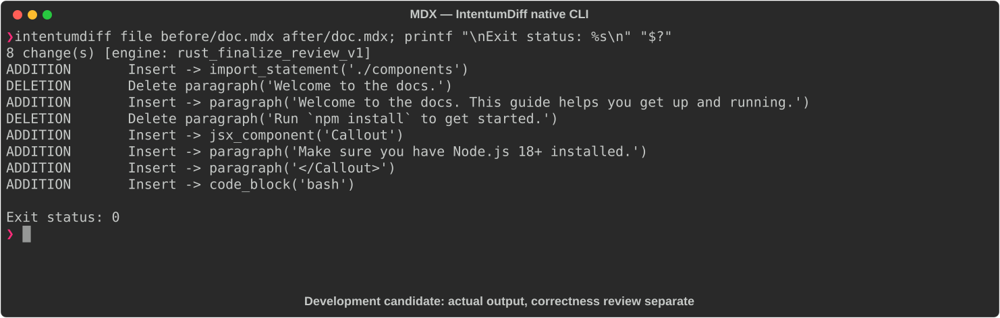

# MDX

[All languages](../gallery.md)

These real terminal captures use a historical development build. They are not current release certification; independent output review and current installed-wheel scenario checks remain pending.

## Overview

This worked example compares `doc.mdx`. Advertised filename extensions: `.mdx`.

## What changes

Import Callout; expand welcome paragraph; add informational Callout requiring Node.js 18+; replace inline npm install instruction with bash code block installing my-package.

## Before

````text
# Getting Started

Welcome to the docs.

## Installation

Run `npm install` to get started.
````

## After

````text
import { Callout } from './components'

# Getting Started

Welcome to the docs. This guide helps you get up and running.

<Callout type="info">
  Make sure you have Node.js 18+ installed.
</Callout>

## Installation

```bash
npm install my-package
```
````

## Things to know

- Rendering depends on the external ./components Callout export, which is not provided.

## Recorded output



Recorded from a real native CLI through rs-rich-record. A refactoring label does not prove equivalent behavior. [Build identities](../provenance.md).

## Scenario coverage

| Scenario | Status |
|---|---|
| Meaningful edit | Source example reviewed; output captured; independent result certification pending |
| Unchanged content | Not yet certified for this candidate |
| Populate / clear a file | Not yet certified for this candidate |
| Add / delete an entity | Not yet certified for this candidate |
| Rename a symbol | Not yet certified for this candidate |
| Move / reorder code | Not yet certified for this candidate |
| Formatting only | Not yet certified for this candidate |
| Git file rename / move | Not yet certified for this candidate |
| Mixed move and edit | Not yet certified for this candidate |
| Invalid syntax / actionable error | Not yet certified for this candidate |
| Guardrail review | Not yet certified for this candidate |

## Try it

Save the two source blocks as separate files with the shown extension, then compare them:

```bash
intentumdiff file before/doc.mdx after/doc.mdx
```

The installed Python wheel includes its parser components. The native CLI requires a component directory. Compare the result with the source change described above; agreement between APIs alone is not proof of correctness.
