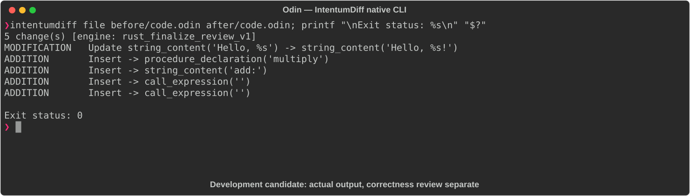

# Odin

[All languages](../gallery.md)

These real terminal captures use a historical development build. They are not current release certification; independent output review and current installed-wheel scenario checks remain pending.

## Overview

This worked example compares `code.odin`. Advertised filename extensions: `.odin`.

## What changes

Add exclamation mark to greeting; add multiply procedure; label addition output and print multiplication result. Reformat add into a single line without changing its arithmetic.

## Before

````text
package main

import "core:fmt"

greet :: proc(name: string) {
    fmt.printf("Hello, %s\n", name)
}

add :: proc(a, b: int) -> int {
    return a + b
}

main :: proc() {
    greet("World")
    fmt.println(add(3, 4))
}
````

## After

````text
package main

import "core:fmt"

greet :: proc(name: string) {
    fmt.printf("Hello, %s!\n", name)
}

add :: proc(a, b: int) -> int { return a + b }

multiply :: proc(a, b: int) -> int { return a * b }

main :: proc() {
    greet("World")
    fmt.println("add:", add(3, 4))
    fmt.println("mul:", multiply(3, 4))
}
````

## Things to know

## Recorded output



Recorded from a real native CLI through rs-rich-record. A refactoring label does not prove equivalent behavior. [Build identities](../provenance.md).

## Scenario coverage

| Scenario | Status |
|---|---|
| Meaningful edit | Source example reviewed; output captured; independent result certification pending |
| Unchanged content | Not yet certified for this candidate |
| Populate / clear a file | Not yet certified for this candidate |
| Add / delete an entity | Not yet certified for this candidate |
| Rename a symbol | Not yet certified for this candidate |
| Move / reorder code | Not yet certified for this candidate |
| Formatting only | Not yet certified for this candidate |
| Git file rename / move | Not yet certified for this candidate |
| Mixed move and edit | Not yet certified for this candidate |
| Invalid syntax / actionable error | Not yet certified for this candidate |
| Guardrail review | Not yet certified for this candidate |

## Try it

Save the two source blocks as separate files with the shown extension, then compare them:

```bash
intentumdiff file before/code.odin after/code.odin
```

The installed Python wheel includes its parser components. The native CLI requires a component directory. Compare the result with the source change described above; agreement between APIs alone is not proof of correctness.
