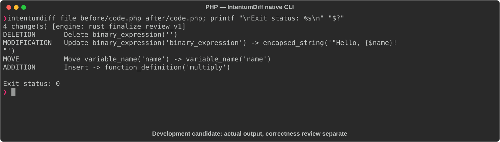

# PHP

[All languages](../gallery.md)

These real terminal captures use a historical development build. They are not current release certification; independent output review and current installed-wheel scenario checks remain pending.

## Overview

This worked example compares `code.php`. Advertised filename extensions: `.php`.

## What changes

Add string/void annotations to greet and int parameter/return annotations to add; rewrite greeting concatenation as interpolation with the same displayed string; add typed multiply function.

## Before

````text
<?php
function greet($name) {
    echo "Hello, " . $name . "!\n";
}

function add($a, $b) {
    return $a + $b;
}
````

## After

````text
<?php
function greet(string $name): void {
    echo "Hello, {$name}!\n";
}

function add(int $a, int $b): int {
    return $a + $b;
}

function multiply(int $a, int $b): int {
    return $a * $b;
}
````

## Things to know

- Type declarations constrain/coerce accepted values and return values; greeting rewrite alone preserves output for string inputs.

## Recorded output



Recorded from a real native CLI through rs-rich-record. A refactoring label does not prove equivalent behavior. [Build identities](../provenance.md).

## Scenario coverage

| Scenario | Status |
|---|---|
| Meaningful edit | Source example reviewed; output captured; independent result certification pending |
| Unchanged content | Not yet certified for this candidate |
| Populate / clear a file | Not yet certified for this candidate |
| Add / delete an entity | Not yet certified for this candidate |
| Rename a symbol | Not yet certified for this candidate |
| Move / reorder code | Not yet certified for this candidate |
| Formatting only | Not yet certified for this candidate |
| Git file rename / move | Not yet certified for this candidate |
| Mixed move and edit | Not yet certified for this candidate |
| Invalid syntax / actionable error | Not yet certified for this candidate |
| Guardrail review | Not yet certified for this candidate |

## Try it

Save the two source blocks as separate files with the shown extension, then compare them:

```bash
intentumdiff file before/code.php after/code.php
```

The installed Python wheel includes its parser components. The native CLI requires a component directory. Compare the result with the source change described above; agreement between APIs alone is not proof of correctness.
