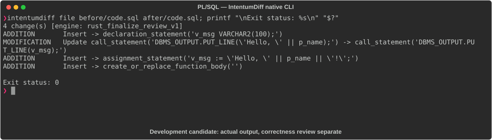

# PL/SQL

[All languages](../gallery.md)

These real terminal captures use a historical development build. They are not current release certification; independent output review and current installed-wheel scenario checks remain pending.

## Overview

This worked example compares `code.sql`. Advertised filename extensions: `.sql`.

## What changes

Declare VARCHAR2(100) v_msg in greet, build greeting with appended exclamation mark and print v_msg; add multiply_nums function; leave add_nums unchanged.

## Before

````text
CREATE OR REPLACE PROCEDURE greet(p_name IN VARCHAR2) IS
BEGIN
  DBMS_OUTPUT.PUT_LINE('Hello, ' || p_name);
END greet;
/

CREATE OR REPLACE FUNCTION add_nums(p_a IN NUMBER, p_b IN NUMBER)
  RETURN NUMBER IS
BEGIN
  RETURN p_a + p_b;
END add_nums;
/
````

## After

````text
CREATE OR REPLACE PROCEDURE greet(p_name IN VARCHAR2) IS
  v_msg VARCHAR2(100);
BEGIN
  v_msg := 'Hello, ' || p_name || '!';
  DBMS_OUTPUT.PUT_LINE(v_msg);
END greet;
/

CREATE OR REPLACE FUNCTION add_nums(p_a IN NUMBER, p_b IN NUMBER)
  RETURN NUMBER IS
BEGIN
  RETURN p_a + p_b;
END add_nums;
/

CREATE OR REPLACE FUNCTION multiply_nums(p_a IN NUMBER, p_b IN NUMBER)
  RETURN NUMBER IS
BEGIN
  RETURN p_a * p_b;
END multiply_nums;
/
````

## Things to know

- New 100-character local imposes a length bound on greeting construction.

- Generic code.sql filename does not independently identify PL/SQL rather than another SQL dialect.

## Recorded output



Recorded from a real native CLI through rs-rich-record. A refactoring label does not prove equivalent behavior. [Build identities](../provenance.md).

## Scenario coverage

| Scenario | Status |
|---|---|
| Meaningful edit | Source example reviewed; output captured; independent result certification pending |
| Unchanged content | Not yet certified for this candidate |
| Populate / clear a file | Not yet certified for this candidate |
| Add / delete an entity | Not yet certified for this candidate |
| Rename a symbol | Not yet certified for this candidate |
| Move / reorder code | Not yet certified for this candidate |
| Formatting only | Not yet certified for this candidate |
| Git file rename / move | Not yet certified for this candidate |
| Mixed move and edit | Not yet certified for this candidate |
| Invalid syntax / actionable error | Not yet certified for this candidate |
| Guardrail review | Not yet certified for this candidate |

## Try it

Save the two source blocks as separate files with the shown extension, then compare them:

```bash
intentumdiff file before/code.sql after/code.sql
```

The installed Python wheel includes its parser components. The native CLI requires a component directory. Compare the result with the source change described above; agreement between APIs alone is not proof of correctness.
