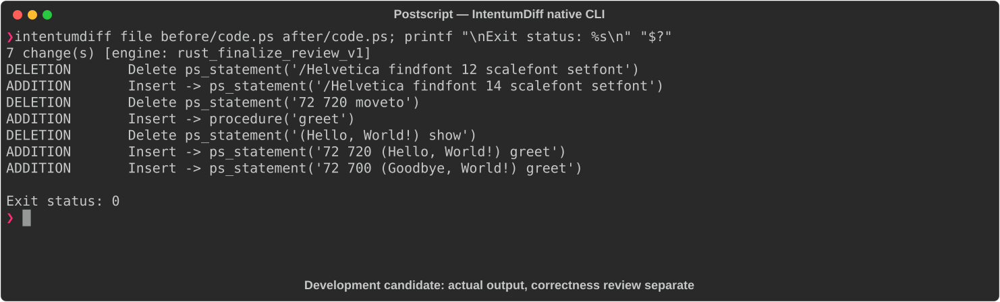

# Postscript

[All languages](../gallery.md)

These real terminal captures use a historical development build. They are not current release certification; independent output review and current installed-wheel scenario checks remain pending.

## Overview

This worked example compares `code.ps`. Advertised filename extensions: `.ps`.

## What changes

Increase Helvetica font size from 12 to 14; introduce greet procedure wrapping moveto and show; replace direct greeting display with two greet invocations intended to display Hello and Goodbye at different positions.

## Before

````text
%!PS
/Helvetica findfont 12 scalefont setfont
72 720 moveto
(Hello, World!) show
showpage
````

## After

````text
%!PS
/Helvetica findfont 14 scalefont setfont
/greet {
    moveto
    show
} def
72 720 (Hello, World!) greet
72 700 (Goodbye, World!) greet
showpage
````

## Things to know

- New calls push x y string, but greet executes moveto first while the string is on top of the operand stack. The new program appears to raise a typecheck error before rendering either greeting; this is not a valid successful greeting refactor.

## Recorded output



Recorded from a real native CLI through rs-rich-record. A refactoring label does not prove equivalent behavior. [Build identities](../provenance.md).

## Scenario coverage

| Scenario | Status |
|---|---|
| Meaningful edit | Source example reviewed; output captured; independent result certification pending |
| Unchanged content | Not yet certified for this candidate |
| Populate / clear a file | Not yet certified for this candidate |
| Add / delete an entity | Not yet certified for this candidate |
| Rename a symbol | Not yet certified for this candidate |
| Move / reorder code | Not yet certified for this candidate |
| Formatting only | Not yet certified for this candidate |
| Git file rename / move | Not yet certified for this candidate |
| Mixed move and edit | Not yet certified for this candidate |
| Invalid syntax / actionable error | Not yet certified for this candidate |
| Guardrail review | Not yet certified for this candidate |

## Try it

Save the two source blocks as separate files with the shown extension, then compare them:

```bash
intentumdiff file before/code.ps after/code.ps
```

The installed Python wheel includes its parser components. The native CLI requires a component directory. Compare the result with the source change described above; agreement between APIs alone is not proof of correctness.
