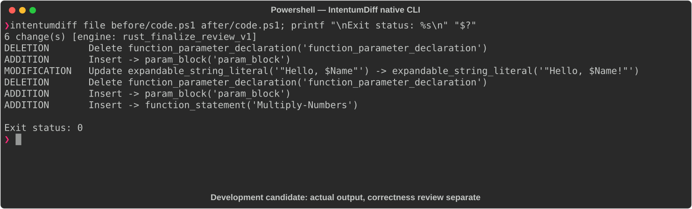

# Powershell

[All languages](../gallery.md)

These real terminal captures use a historical development build. They are not current release certification; independent output review and current installed-wheel scenario checks remain pending.

## Overview

This worked example compares `code.ps1`. Advertised filename extensions: `.ps1`.

## What changes

Replace inline parameters with param blocks; type Greet name as string and default it to World; append greeting exclamation mark; type Add-Numbers parameters as int; add typed Multiply-Numbers.

## Before

````text
function Greet($Name) {
    Write-Host "Hello, $Name"
}

function Add-Numbers($A, $B) {
    return $A + $B
}
````

## After

````text
function Greet {
    param(
        [string]$Name = 'World'
    )
    Write-Host "Hello, $Name!"
}

function Add-Numbers {
    param(
        [int]$A,
        [int]$B
    )
    return $A + $B
}

function Multiply-Numbers {
    param(
        [int]$A,
        [int]$B
    )
    return $A * $B
}
````

## Things to know

- Integer parameter conversion changes accepted inputs and arithmetic behavior compared with untyped parameters.

- This parser is explicitly unavailable on Windows ARM64.

## Recorded output



Recorded from a real native CLI through rs-rich-record. A refactoring label does not prove equivalent behavior. [Build identities](../provenance.md).

## Scenario coverage

| Scenario | Status |
|---|---|
| Meaningful edit | Source example reviewed; output captured; independent result certification pending |
| Unchanged content | Not yet certified for this candidate |
| Populate / clear a file | Not yet certified for this candidate |
| Add / delete an entity | Not yet certified for this candidate |
| Rename a symbol | Not yet certified for this candidate |
| Move / reorder code | Not yet certified for this candidate |
| Formatting only | Not yet certified for this candidate |
| Git file rename / move | Not yet certified for this candidate |
| Mixed move and edit | Not yet certified for this candidate |
| Invalid syntax / actionable error | Not yet certified for this candidate |
| Guardrail review | Not yet certified for this candidate |

## Try it

Save the two source blocks as separate files with the shown extension, then compare them:

```bash
intentumdiff file before/code.ps1 after/code.ps1
```

The installed Python wheel includes its parser components. The native CLI requires a component directory. Compare the result with the source change described above; agreement between APIs alone is not proof of correctness.
