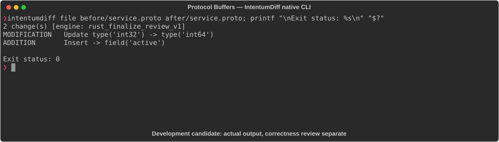

# Protocol Buffers

[All languages](../gallery.md)

These real terminal captures use a historical development build. They are not current release certification; independent output review and current installed-wheel scenario checks remain pending.

## Overview

This worked example compares `service.proto`. Advertised filename extensions: `.proto`.

## What changes

Change User.login_count field 2 from int32 to int64; add bool active field 3; preserve name field 1.

## Before

````text
syntax = "proto3";

message User {
  string name = 1;
  int32 login_count = 2;
}
````

## After

````text
syntax = "proto3";

message User {
  string name = 1;
  int64 login_count = 2;
  bool active = 3;
}
````

## Things to know

- Widened field type changes generated APIs and value range; compatibility must not be inferred solely from preserved field number.

## Recorded output



Recorded from a real native CLI through rs-rich-record. A refactoring label does not prove equivalent behavior. [Build identities](../provenance.md).

## Scenario coverage

| Scenario | Status |
|---|---|
| Meaningful edit | Source example reviewed; output captured; independent result certification pending |
| Unchanged content | Not yet certified for this candidate |
| Populate / clear a file | Not yet certified for this candidate |
| Add / delete an entity | Not yet certified for this candidate |
| Rename a symbol | Not yet certified for this candidate |
| Move / reorder code | Not yet certified for this candidate |
| Formatting only | Not yet certified for this candidate |
| Git file rename / move | Not yet certified for this candidate |
| Mixed move and edit | Not yet certified for this candidate |
| Invalid syntax / actionable error | Not yet certified for this candidate |
| Guardrail review | Not yet certified for this candidate |

## Try it

Save the two source blocks as separate files with the shown extension, then compare them:

```bash
intentumdiff file before/service.proto after/service.proto
```

The installed Python wheel includes its parser components. The native CLI requires a component directory. Compare the result with the source change described above; agreement between APIs alone is not proof of correctness.
