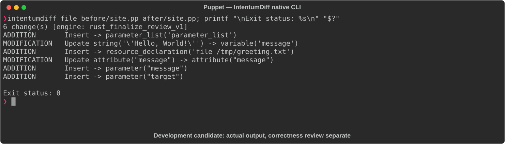

# Puppet

[All languages](../gallery.md)

These real terminal captures use a historical development build. They are not current release certification; independent output review and current installed-wheel scenario checks remain pending.

## Overview

This worked example compares `site.pp`. Advertised filename extensions: `.pp`.

## What changes

Parameterize greeting class with message and target strings; use message parameter in notify; add /tmp/greeting.txt file resource with message content.

## Before

````text
class greeting {
  notify { 'hello':
    message => 'Hello, World!',
  }
}
````

## After

````text
class greeting (
  String $message = 'Hello, World!',
  String $target   = 'console',
) {
  notify { 'hello':
    message => $message,
  }

  file { '/tmp/greeting.txt':
    ensure  => present,
    content => $message,
  }
}
````

## Things to know

- New target parameter is unused; it does not select a destination.

- Class declaration alone does not instantiate its resources.

## Recorded output



Recorded from a real native CLI through rs-rich-record. A refactoring label does not prove equivalent behavior. [Build identities](../provenance.md).

## Scenario coverage

| Scenario | Status |
|---|---|
| Meaningful edit | Source example reviewed; output captured; independent result certification pending |
| Unchanged content | Not yet certified for this candidate |
| Populate / clear a file | Not yet certified for this candidate |
| Add / delete an entity | Not yet certified for this candidate |
| Rename a symbol | Not yet certified for this candidate |
| Move / reorder code | Not yet certified for this candidate |
| Formatting only | Not yet certified for this candidate |
| Git file rename / move | Not yet certified for this candidate |
| Mixed move and edit | Not yet certified for this candidate |
| Invalid syntax / actionable error | Not yet certified for this candidate |
| Guardrail review | Not yet certified for this candidate |

## Try it

Save the two source blocks as separate files with the shown extension, then compare them:

```bash
intentumdiff file before/site.pp after/site.pp
```

The installed Python wheel includes its parser components. The native CLI requires a component directory. Compare the result with the source change described above; agreement between APIs alone is not proof of correctness.
