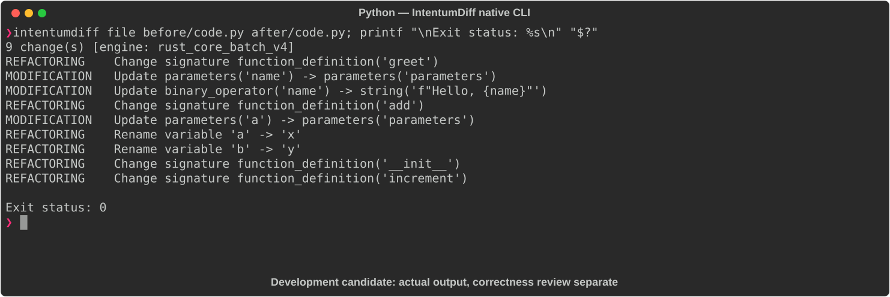
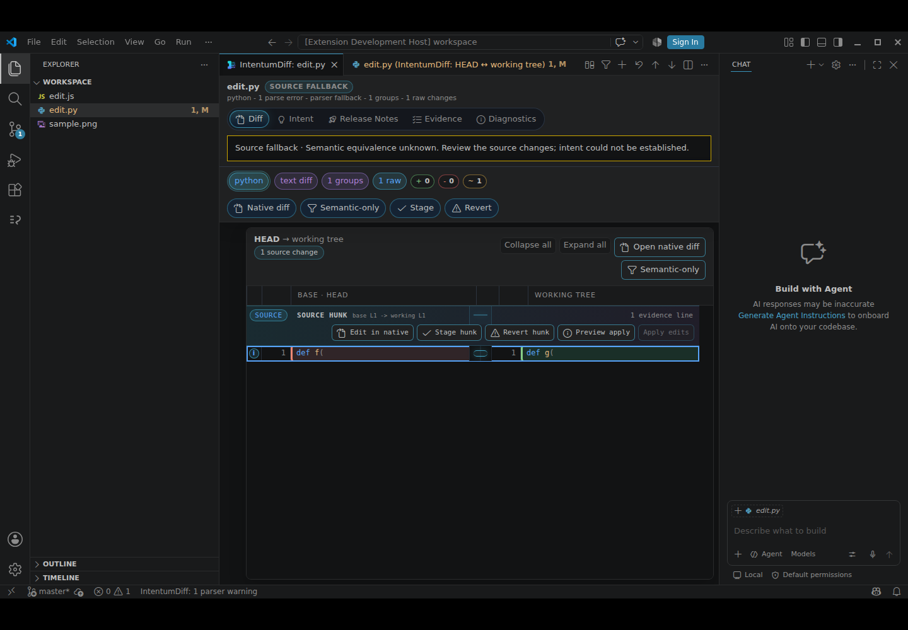

# Python

[All languages](../gallery.md)

These real terminal captures use a historical development build. They are not current release certification; independent output review and current installed-wheel scenario checks remain pending.

## Overview

This worked example compares `code.py`. Advertised filename extensions: `.py`, `.pyi`.

## What changes

Add parameter, return, and count annotations; rewrite greet concatenation as f-string; rename add parameters a/b to x/y and update references; preserve Counter increment arithmetic.

## Before

````text
def greet(name):
    print("Hello, " + name)

def add(a, b):
    return a + b

class Counter:
    def __init__(self):
        self.count = 0

    def increment(self):
        self.count += 1
````

## After

````text
def greet(name: str) -> None:
    print(f"Hello, {name}")

def add(x: int, y: int) -> int:
    return x + y

class Counter:
    def __init__(self) -> None:
        self.count: int = 0

    def increment(self) -> None:
        self.count += 1
````

## Things to know

- Parameter renaming changes keyword-call compatibility (add(a=..., b=...) no longer matches).

- F-string formatting accepts some non-string inputs that old string concatenation rejected; annotations do not enforce runtime types.

## Recorded output



Recorded from a real native CLI through rs-rich-record. A refactoring label does not prove equivalent behavior. [Build identities](../provenance.md).

## Scenario coverage

| Scenario | Status |
|---|---|
| Meaningful edit | Source example reviewed; output captured; independent result certification pending |
| Unchanged content | Not yet certified for this candidate |
| Populate / clear a file | Not yet certified for this candidate |
| Add / delete an entity | Not yet certified for this candidate |
| Rename a symbol | Not yet certified for this candidate |
| Move / reorder code | Not yet certified for this candidate |
| Formatting only | Not yet certified for this candidate |
| Git file rename / move | Not yet certified for this candidate |
| Mixed move and edit | Not yet certified for this candidate |
| Invalid syntax / actionable error | Not yet certified for this candidate |
| Guardrail review | Not yet certified for this candidate |

## Try it

Save the two source blocks as separate files with the shown extension, then compare them:

```bash
intentumdiff file before/code.py after/code.py
```

The installed Python wheel includes its parser components. The native CLI requires a component directory. Compare the result with the source change described above; agreement between APIs alone is not proof of correctness.

## VS Code incomplete edit

This deliberately incomplete Python example changes `def f(` to `def g(`.
The identifier changes, but neither input is a complete declaration. The expected result is
an explicit source fallback with parse errors, not a claim of semantic equivalence or a
style-only change.



The current installed-VSIX capture shows the source change and “semantic equivalence unknown”.
See [VS Code capabilities](../../vscode.md) and [capture provenance](../../vscode-evidence.md).
Additional VS Code captures for additions, deletions, refactors and file moves remain pending.
