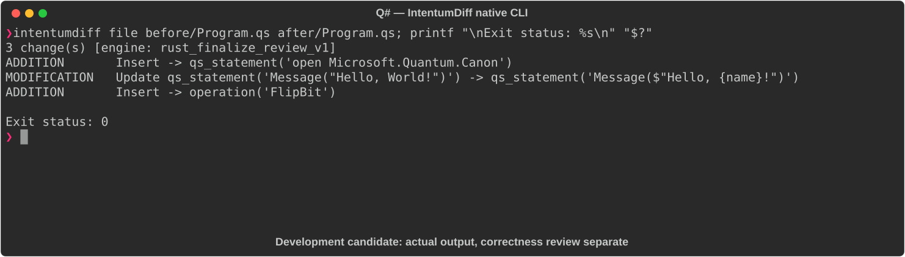

# Q#

[All languages](../gallery.md)

These real terminal captures use a historical development build. They are not current release certification; independent output review and current installed-wheel scenario checks remain pending.

## Overview

This worked example compares `Program.qs`. Advertised filename extensions: `.qs`.

## What changes

Add Canon namespace import; change SayHello from zero arguments to a String name parameter and interpolated greeting; add FlipBit allocating a qubit, applying X, measuring, resetting, and returning result.

## Before

````text
namespace Demo {
    open Microsoft.Quantum.Intrinsic;

    operation SayHello() : Unit {
        Message("Hello, World!");
    }
}
````

## After

````text
namespace Demo {
    open Microsoft.Quantum.Intrinsic;
    open Microsoft.Quantum.Canon;

    operation SayHello(name : String) : Unit {
        Message($"Hello, {name}!");
    }

    operation FlipBit() : Result {
        use q = Qubit();
        X(q);
        let result = M(q);
        Reset(q);
        return result;
    }
}
````

## Things to know

- Q# namespace and library compatibility depends on SDK generation; no Q# compiler validation was performed.

## Recorded output



Recorded from a real native CLI through rs-rich-record. A refactoring label does not prove equivalent behavior. [Build identities](../provenance.md).

## Scenario coverage

| Scenario | Status |
|---|---|
| Meaningful edit | Source example reviewed; output captured; independent result certification pending |
| Unchanged content | Not yet certified for this candidate |
| Populate / clear a file | Not yet certified for this candidate |
| Add / delete an entity | Not yet certified for this candidate |
| Rename a symbol | Not yet certified for this candidate |
| Move / reorder code | Not yet certified for this candidate |
| Formatting only | Not yet certified for this candidate |
| Git file rename / move | Not yet certified for this candidate |
| Mixed move and edit | Not yet certified for this candidate |
| Invalid syntax / actionable error | Not yet certified for this candidate |
| Guardrail review | Not yet certified for this candidate |

## Try it

Save the two source blocks as separate files with the shown extension, then compare them:

```bash
intentumdiff file before/Program.qs after/Program.qs
```

The installed Python wheel includes its parser components. The native CLI requires a component directory. Compare the result with the source change described above; agreement between APIs alone is not proof of correctness.
