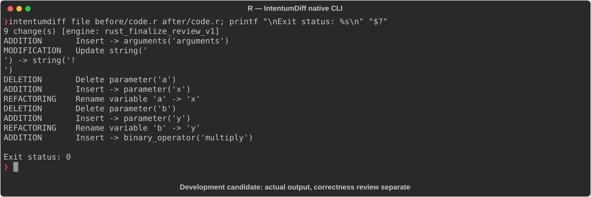

# R

[All languages](../gallery.md)

These real terminal captures use a historical development build. They are not current release certification; independent output review and current installed-wheel scenario checks remain pending.

## Overview

This worked example compares `code.r`. Advertised filename extensions: `.r`.

## What changes

Rewrite greeting using paste0 and add exclamation mark; rename add formals a/b to x/y and shorten its body; add multiply.

## Before

````text
greet <- function(name) {
  cat("Hello, ", name, "\n")
}

add <- function(a, b) {
  a + b
}
````

## After

````text
greet <- function(name) {
  cat(paste0("Hello, ", name, "!\n"))
}

add <- function(x, y) x + y

multiply <- function(x, y) x * y
````

## Things to know

- Old cat uses its default separator between arguments, so paste0 also changes spacing.

- Renaming formals changes named-argument compatibility.

## Recorded output



Recorded from a real native CLI through rs-rich-record. A refactoring label does not prove equivalent behavior. [Build identities](../provenance.md).

## Scenario coverage

| Scenario | Status |
|---|---|
| Meaningful edit | Source example reviewed; output captured; independent result certification pending |
| Unchanged content | Not yet certified for this candidate |
| Populate / clear a file | Not yet certified for this candidate |
| Add / delete an entity | Not yet certified for this candidate |
| Rename a symbol | Not yet certified for this candidate |
| Move / reorder code | Not yet certified for this candidate |
| Formatting only | Not yet certified for this candidate |
| Git file rename / move | Not yet certified for this candidate |
| Mixed move and edit | Not yet certified for this candidate |
| Invalid syntax / actionable error | Not yet certified for this candidate |
| Guardrail review | Not yet certified for this candidate |

## Try it

Save the two source blocks as separate files with the shown extension, then compare them:

```bash
intentumdiff file before/code.r after/code.r
```

The installed Python wheel includes its parser components. The native CLI requires a component directory. Compare the result with the source change described above; agreement between APIs alone is not proof of correctness.
