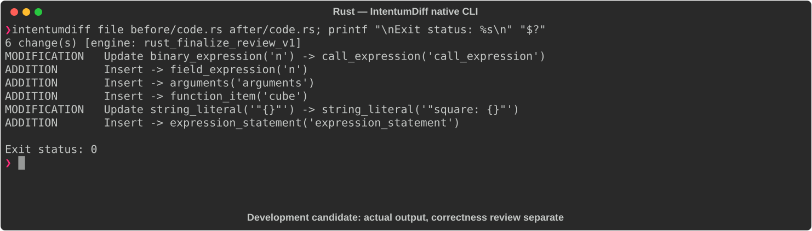

# Rust

[All languages](../gallery.md)

These real terminal captures use a historical development build. They are not current release certification; independent output review and current installed-wheel scenario checks remain pending.

## Overview

This worked example compares `code.rs`. Advertised filename extensions: `.rs`.

## What changes

Rewrite square calculation as n.pow(2); add cube using n.pow(3); label square output and print cube(3).

## Before

````text
fn square(n: i32) -> i32 {
    n * n
}

fn main() {
    println!("{}", square(5));
}
````

## After

````text
fn square(n: i32) -> i32 {
    n.pow(2)
}

fn cube(n: i32) -> i32 {
    n.pow(3)
}

fn main() {
    println!("square: {}", square(5));
    println!("cube:   {}", cube(3));
}
````

## Things to know

- For the shown inputs, square remains 25 and new cube output is 27; this example does not establish arbitrary overflow-mode equivalence.

## Recorded output



Recorded from a real native CLI through rs-rich-record. A refactoring label does not prove equivalent behavior. [Build identities](../provenance.md).

## Scenario coverage

| Scenario | Status |
|---|---|
| Meaningful edit | Source example reviewed; output captured; independent result certification pending |
| Unchanged content | Not yet certified for this candidate |
| Populate / clear a file | Not yet certified for this candidate |
| Add / delete an entity | Not yet certified for this candidate |
| Rename a symbol | Not yet certified for this candidate |
| Move / reorder code | Not yet certified for this candidate |
| Formatting only | Not yet certified for this candidate |
| Git file rename / move | Not yet certified for this candidate |
| Mixed move and edit | Not yet certified for this candidate |
| Invalid syntax / actionable error | Not yet certified for this candidate |
| Guardrail review | Not yet certified for this candidate |

## Try it

Save the two source blocks as separate files with the shown extension, then compare them:

```bash
intentumdiff file before/code.rs after/code.rs
```

The installed Python wheel includes its parser components. The native CLI requires a component directory. Compare the result with the source change described above; agreement between APIs alone is not proof of correctness.
