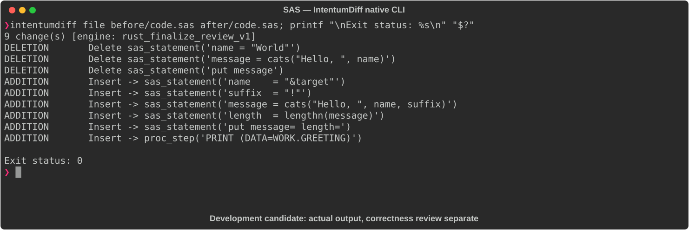

# SAS

[All languages](../gallery.md)

These real terminal captures use a historical development build. They are not current release certification; independent output review and current installed-wheel scenario checks remain pending.

## Overview

This worked example compares `code.sas`. Advertised filename extensions: `.sas`.

## What changes

Introduce target macro variable and resolve it into name; add suffix, append it to message, compute lengthn(message), log named message/length values, and print work.greeting dataset.

## Before

````text
data work.greeting;
  name = "World";
  message = cats("Hello, ", name);
  put message;
run;
````

## After

````text
%let target = World;

data work.greeting;
  name    = "&target";
  suffix  = "!";
  message = cats("Hello, ", name, suffix);
  length  = lengthn(message);
  put message= length=;
run;

proc print data=work.greeting; run;
````

## Things to know

- CATS strips leading/trailing blanks from each argument, including the space in Hello, ; do not claim the generated greeting contains a space after the comma.

## Recorded output



Recorded from a real native CLI through rs-rich-record. A refactoring label does not prove equivalent behavior. [Build identities](../provenance.md).

## Scenario coverage

| Scenario | Status |
|---|---|
| Meaningful edit | Source example reviewed; output captured; independent result certification pending |
| Unchanged content | Not yet certified for this candidate |
| Populate / clear a file | Not yet certified for this candidate |
| Add / delete an entity | Not yet certified for this candidate |
| Rename a symbol | Not yet certified for this candidate |
| Move / reorder code | Not yet certified for this candidate |
| Formatting only | Not yet certified for this candidate |
| Git file rename / move | Not yet certified for this candidate |
| Mixed move and edit | Not yet certified for this candidate |
| Invalid syntax / actionable error | Not yet certified for this candidate |
| Guardrail review | Not yet certified for this candidate |

## Try it

Save the two source blocks as separate files with the shown extension, then compare them:

```bash
intentumdiff file before/code.sas after/code.sas
```

The installed Python wheel includes its parser components. The native CLI requires a component directory. Compare the result with the source change described above; agreement between APIs alone is not proof of correctness.
