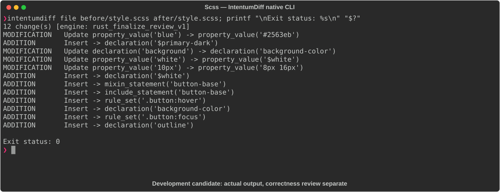

# Scss

[All languages](../gallery.md)

These real terminal captures use a historical development build. They are not current release certification; independent output review and current installed-wheel scenario checks remain pending.

## Overview

This worked example compares `style.scss`. Advertised filename extensions: `.scss`.

## What changes

Change primary blue to #2563eb; add dark-primary and white variables; introduce button-base mixin adding border, radius, cursor, and transition; include mixin; use background-color, change padding to 8px 16px, and add hover/focus rules.

## Before

````text
$primary: blue;

.button {
  background: $primary;
  color: white;
  padding: 10px;
}
````

## After

````text
$primary:     #2563eb;
$primary-dark: #1d4ed8;
$white:        #ffffff;

@mixin button-base {
  border: none;
  border-radius: 6px;
  cursor: pointer;
  transition: background-color 0.2s ease;
}

.button {
  @include button-base;
  background-color: $primary;
  color: $white;
  padding: 8px 16px;

  &:hover { background-color: $primary-dark; }
  &:focus { outline: 2px solid #93c5fd; }
}
````

## Things to know

- Replacing background shorthand with background-color can change whether other background properties are reset.

## Recorded output



Recorded from a real native CLI through rs-rich-record. A refactoring label does not prove equivalent behavior. [Build identities](../provenance.md).

## Scenario coverage

| Scenario | Status |
|---|---|
| Meaningful edit | Source example reviewed; output captured; independent result certification pending |
| Unchanged content | Not yet certified for this candidate |
| Populate / clear a file | Not yet certified for this candidate |
| Add / delete an entity | Not yet certified for this candidate |
| Rename a symbol | Not yet certified for this candidate |
| Move / reorder code | Not yet certified for this candidate |
| Formatting only | Not yet certified for this candidate |
| Git file rename / move | Not yet certified for this candidate |
| Mixed move and edit | Not yet certified for this candidate |
| Invalid syntax / actionable error | Not yet certified for this candidate |
| Guardrail review | Not yet certified for this candidate |

## Try it

Save the two source blocks as separate files with the shown extension, then compare them:

```bash
intentumdiff file before/style.scss after/style.scss
```

The installed Python wheel includes its parser components. The native CLI requires a component directory. Compare the result with the source change described above; agreement between APIs alone is not proof of correctness.
