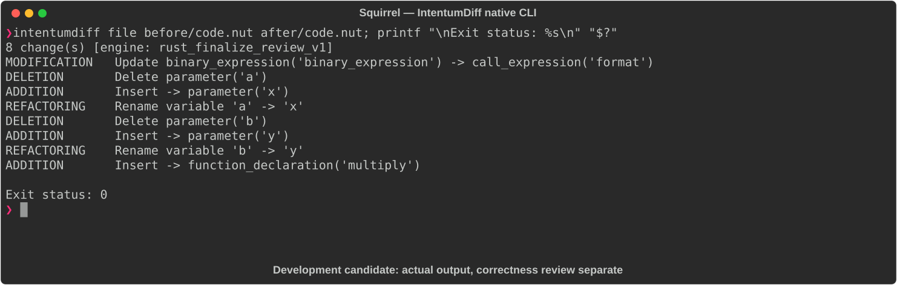

# Squirrel

[All languages](../gallery.md)

These real terminal captures use a historical development build. They are not current release certification; independent output review and current installed-wheel scenario checks remain pending.

## Overview

This worked example compares `code.nut`. Advertised filename extensions: `.nut`.

## What changes

Replace greeting concatenation with format call and append exclamation mark; rename add parameters a/b to x/y; add multiply.

## Before

````text
function greet(name) {
    print("Hello, " + name + "\n");
}

function add(a, b) {
    return a + b;
}
````

## After

````text
function greet(name) {
    print(format("Hello, %s!\n", name));
}

function add(x, y) {
    return x + y;
}

function multiply(x, y) {
    return x * y;
}
````

## Things to know

- The format %s call introduces a formatting/type contract; do not assume equivalence for all non-string inputs.

## Recorded output



Recorded from a real native CLI through rs-rich-record. A refactoring label does not prove equivalent behavior. [Build identities](../provenance.md).

## Scenario coverage

| Scenario | Status |
|---|---|
| Meaningful edit | Source example reviewed; output captured; independent result certification pending |
| Unchanged content | Not yet certified for this candidate |
| Populate / clear a file | Not yet certified for this candidate |
| Add / delete an entity | Not yet certified for this candidate |
| Rename a symbol | Not yet certified for this candidate |
| Move / reorder code | Not yet certified for this candidate |
| Formatting only | Not yet certified for this candidate |
| Git file rename / move | Not yet certified for this candidate |
| Mixed move and edit | Not yet certified for this candidate |
| Invalid syntax / actionable error | Not yet certified for this candidate |
| Guardrail review | Not yet certified for this candidate |

## Try it

Save the two source blocks as separate files with the shown extension, then compare them:

```bash
intentumdiff file before/code.nut after/code.nut
```

The installed Python wheel includes its parser components. The native CLI requires a component directory. Compare the result with the source change described above; agreement between APIs alone is not proof of correctness.
