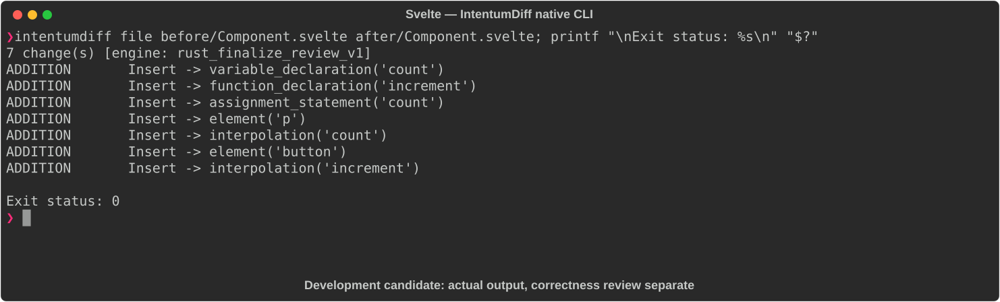

# Svelte

[All languages](../gallery.md)

These real terminal captures use a historical development build. They are not current release certification; independent output review and current installed-wheel scenario checks remain pending.

## Overview

This worked example compares `Component.svelte`. Advertised filename extensions: `.svelte`.

## What changes

Add count state initialized to zero, increment function, displayed count paragraph, and click-bound Increment button; preserve greeting.

## Before

````text
<script>
  let name = 'World';
</script>

<h1>Hello, {name}!</h1>
````

## After

````text
<script>
  let name = 'World';
  let count = 0;

  function increment() {
    count += 1;
  }
</script>

<h1>Hello, {name}!</h1>
<p>Count: {count}</p>
<button on:click={increment}>Increment</button>
````

## Things to know

- Uses legacy on:click syntax and let-based reactivity; coverage depends on supported Svelte mode/version.

## Recorded output



Recorded from a real native CLI through rs-rich-record. A refactoring label does not prove equivalent behavior. [Build identities](../provenance.md).

## Scenario coverage

| Scenario | Status |
|---|---|
| Meaningful edit | Source example reviewed; output captured; independent result certification pending |
| Unchanged content | Not yet certified for this candidate |
| Populate / clear a file | Not yet certified for this candidate |
| Add / delete an entity | Not yet certified for this candidate |
| Rename a symbol | Not yet certified for this candidate |
| Move / reorder code | Not yet certified for this candidate |
| Formatting only | Not yet certified for this candidate |
| Git file rename / move | Not yet certified for this candidate |
| Mixed move and edit | Not yet certified for this candidate |
| Invalid syntax / actionable error | Not yet certified for this candidate |
| Guardrail review | Not yet certified for this candidate |

## Try it

Save the two source blocks as separate files with the shown extension, then compare them:

```bash
intentumdiff file before/Component.svelte after/Component.svelte
```

The installed Python wheel includes its parser components. The native CLI requires a component directory. Compare the result with the source change described above; agreement between APIs alone is not proof of correctness.
