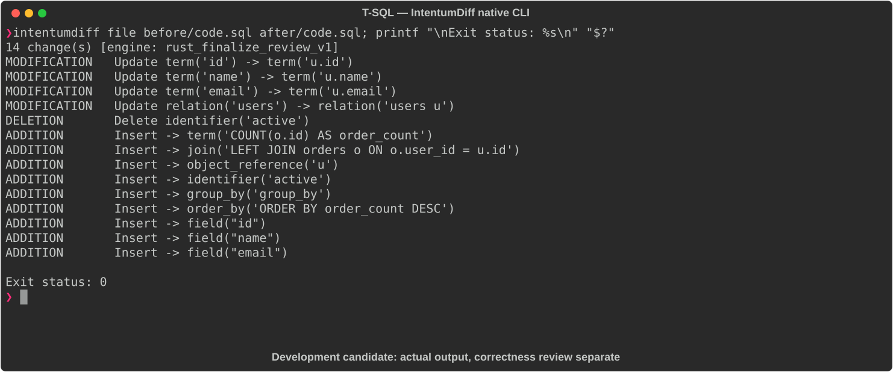

# T-SQL

[All languages](../gallery.md)

These real terminal captures use a historical development build. They are not current release certification; independent output review and current installed-wheel scenario checks remain pending.

## Overview

This worked example compares `code.sql`. Advertised filename extensions: `.tsql`.

## What changes

Alias users, LEFT JOIN orders, add COUNT(o.id) order_count, group by user columns, and order descending by order_count; preserve active-user filter.

## Before

````text
SELECT id, name, email
FROM users
WHERE active = 1;
````

## After

````text
SELECT
    u.id,
    u.name,
    u.email,
    COUNT(o.id) AS order_count
FROM users u
LEFT JOIN orders o ON o.user_id = u.id
WHERE u.active = 1
GROUP BY u.id, u.name, u.email
ORDER BY order_count DESC;
````

## Things to know

- `code.sql` routes through the SQL parser. The query uses broadly shared SQL syntax; this fixture does not demonstrate distinct T-SQL parser selection or dialect-specific correctness. No routing override is applied.

## Recorded output



Recorded from a real native CLI through rs-rich-record. A refactoring label does not prove equivalent behavior. [Build identities](../provenance.md).

## Scenario coverage

| Scenario | Status |
|---|---|
| Meaningful edit | Source example reviewed; output captured; independent result certification pending |
| Unchanged content | Not yet certified for this candidate |
| Populate / clear a file | Not yet certified for this candidate |
| Add / delete an entity | Not yet certified for this candidate |
| Rename a symbol | Not yet certified for this candidate |
| Move / reorder code | Not yet certified for this candidate |
| Formatting only | Not yet certified for this candidate |
| Git file rename / move | Not yet certified for this candidate |
| Mixed move and edit | Not yet certified for this candidate |
| Invalid syntax / actionable error | Not yet certified for this candidate |
| Guardrail review | Not yet certified for this candidate |

## Try it

Save the two source blocks as separate files with the shown extension, then compare them:

```bash
intentumdiff file before/code.sql after/code.sql
```

The installed Python wheel includes its parser components. The native CLI requires a component directory. Compare the result with the source change described above; agreement between APIs alone is not proof of correctness.
