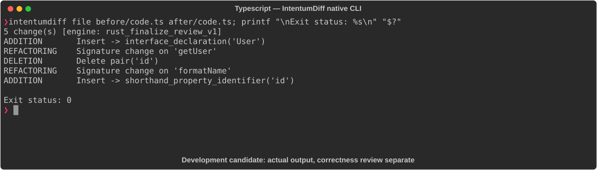

# Typescript

[All languages](../gallery.md)

These real terminal captures use a historical development build. They are not current release certification; independent output review and current installed-wheel scenario checks remain pending.

## Overview

This worked example compares `code.ts`. Advertised filename extensions: `.ts`, `.mts`, `.cts`.

## What changes

Add User interface with numeric id and string name; annotate getUser parameter/return and formatName parameter/return; replace id: id with equivalent object shorthand.

## Before

````text
function getUser(id) {
  return { id: id, name: "Alice" };
}

function formatName(user) {
  return user.name.toUpperCase();
}
````

## After

````text
interface User {
  id: number;
  name: string;
}

function getUser(id: number): User {
  return { id, name: "Alice" };
}

function formatName(user: User): string {
  return user.name.toUpperCase();
}
````

## Things to know

- For accepted inputs, annotations/interface add static contracts without changing emitted calculation; old unannotated parameters can fail noImplicitAny.

## Recorded output



Recorded from a real native CLI through rs-rich-record. A refactoring label does not prove equivalent behavior. [Build identities](../provenance.md).

## Scenario coverage

| Scenario | Status |
|---|---|
| Meaningful edit | Source example reviewed; output captured; independent result certification pending |
| Unchanged content | Not yet certified for this candidate |
| Populate / clear a file | Not yet certified for this candidate |
| Add / delete an entity | Not yet certified for this candidate |
| Rename a symbol | Not yet certified for this candidate |
| Move / reorder code | Not yet certified for this candidate |
| Formatting only | Not yet certified for this candidate |
| Git file rename / move | Not yet certified for this candidate |
| Mixed move and edit | Not yet certified for this candidate |
| Invalid syntax / actionable error | Not yet certified for this candidate |
| Guardrail review | Not yet certified for this candidate |

## Try it

Save the two source blocks as separate files with the shown extension, then compare them:

```bash
intentumdiff file before/code.ts after/code.ts
```

The installed Python wheel includes its parser components. The native CLI requires a component directory. Compare the result with the source change described above; agreement between APIs alone is not proof of correctness.
