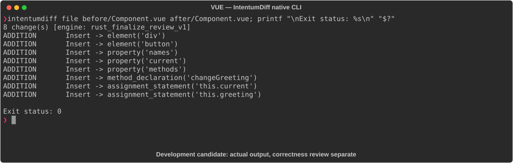

# VUE

[All languages](../gallery.md)

These real terminal captures use a historical development build. They are not current release certification; independent output review and current installed-wheel scenario checks remain pending.

## Overview

This worked example compares `Component.vue`. Advertised filename extensions: `.vue`.

## What changes

Wrap heading in div; add Change button; add names array and current index state; add changeGreeting method incrementing index modulo array length then replacing greeting.

## Before

````text
<template>
  <h1>{{ greeting }}</h1>
</template>

<script>
export default {
  data() {
    return {
      greeting: 'Hello, World!'
    }
  }
}
</script>
````

## After

````text
<template>
  <div>
    <h1>{{ greeting }}</h1>
    <button @click="changeGreeting">Change</button>
  </div>
</template>

<script>
export default {
  data() {
    return {
      greeting: 'Hello, World!',
      names: ['Alice', 'Bob', 'Carol'],
      current: 0
    }
  },
  methods: {
    changeGreeting() {
      this.current = (this.current + 1) % this.names.length;
      this.greeting = 'Hello, ' + this.names[this.current] + '!';
    }
  }
}
</script>
````

## Things to know

- First click selects Bob, not Alice, because current begins at zero and is incremented before lookup.

## Recorded output



Recorded from a real native CLI through rs-rich-record. A refactoring label does not prove equivalent behavior. [Build identities](../provenance.md).

## Scenario coverage

| Scenario | Status |
|---|---|
| Meaningful edit | Source example reviewed; output captured; independent result certification pending |
| Unchanged content | Not yet certified for this candidate |
| Populate / clear a file | Not yet certified for this candidate |
| Add / delete an entity | Not yet certified for this candidate |
| Rename a symbol | Not yet certified for this candidate |
| Move / reorder code | Not yet certified for this candidate |
| Formatting only | Not yet certified for this candidate |
| Git file rename / move | Not yet certified for this candidate |
| Mixed move and edit | Not yet certified for this candidate |
| Invalid syntax / actionable error | Not yet certified for this candidate |
| Guardrail review | Not yet certified for this candidate |

## Try it

Save the two source blocks as separate files with the shown extension, then compare them:

```bash
intentumdiff file before/Component.vue after/Component.vue
```

The installed Python wheel includes its parser components. The native CLI requires a component directory. Compare the result with the source change described above; agreement between APIs alone is not proof of correctness.
