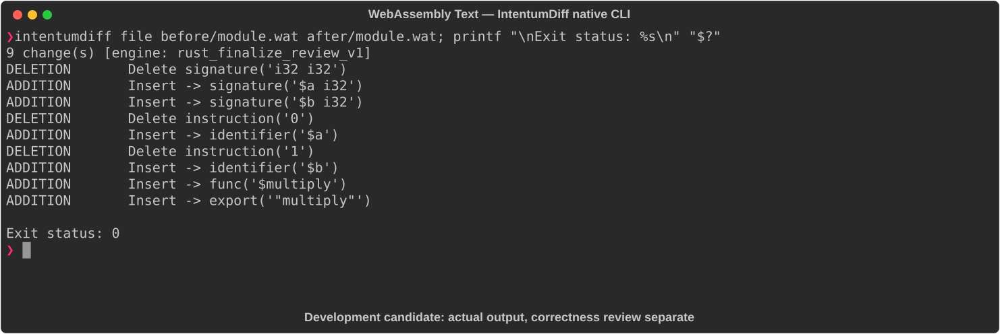

# WebAssembly Text

[All languages](../gallery.md)

These real terminal captures use a historical development build. They are not current release certification; independent output review and current installed-wheel scenario checks remain pending.

## Overview

This worked example compares `module.wat`. Advertised filename extensions: `.wat`.

## What changes

Name add parameters a/b and replace numeric local references with names; add i32 multiplication function and export multiply; preserve add export and arithmetic.

## Before

````text
(module
  (func $add (param i32 i32) (result i32)
    local.get 0
    local.get 1
    i32.add)
  (export "add" (func $add)))
````

## After

````text
(module
  (func $add (param $a i32) (param $b i32) (result i32)
    local.get $a
    local.get $b
    i32.add)
  (func $multiply (param $a i32) (param $b i32) (result i32)
    local.get $a
    local.get $b
    i32.mul)
  (export "add" (func $add))
  (export "multiply" (func $multiply)))
````

## Things to know

## Recorded output



Recorded from a real native CLI through rs-rich-record. A refactoring label does not prove equivalent behavior. [Build identities](../provenance.md).

## Scenario coverage

| Scenario | Status |
|---|---|
| Meaningful edit | Source example reviewed; output captured; independent result certification pending |
| Unchanged content | Not yet certified for this candidate |
| Populate / clear a file | Not yet certified for this candidate |
| Add / delete an entity | Not yet certified for this candidate |
| Rename a symbol | Not yet certified for this candidate |
| Move / reorder code | Not yet certified for this candidate |
| Formatting only | Not yet certified for this candidate |
| Git file rename / move | Not yet certified for this candidate |
| Mixed move and edit | Not yet certified for this candidate |
| Invalid syntax / actionable error | Not yet certified for this candidate |
| Guardrail review | Not yet certified for this candidate |

## Try it

Save the two source blocks as separate files with the shown extension, then compare them:

```bash
intentumdiff file before/module.wat after/module.wat
```

The installed Python wheel includes its parser components. The native CLI requires a component directory. Compare the result with the source change described above; agreement between APIs alone is not proof of correctness.
