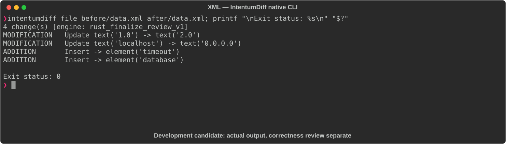

# XML

[All languages](../gallery.md)

These real terminal captures use a historical development build. They are not current release certification; independent output review and current installed-wheel scenario checks remain pending.

## Overview

This worked example compares `data.xml`. Advertised filename extensions: `.xml`.

## What changes

Change version text 1.0 to 2.0 and server host localhost to 0.0.0.0; add server timeout 30 and database host/port/name subtree; preserve server port 8080.

## Before

````text
<?xml version="1.0" encoding="UTF-8"?>
<config>
  <name>MyApp</name>
  <version>1.0</version>
  <server>
    <host>localhost</host>
    <port>8080</port>
  </server>
</config>
````

## After

````text
<?xml version="1.0" encoding="UTF-8"?>
<config>
  <name>MyApp</name>
  <version>2.0</version>
  <server>
    <host>0.0.0.0</host>
    <port>8080</port>
    <timeout>30</timeout>
  </server>
  <database>
    <host>db.example.com</host>
    <port>5432</port>
    <name>mydb</name>
  </database>
</config>
````

## Things to know

- Without an application schema these are document value changes, not proof of runtime service behavior.

## Recorded output



Recorded from a real native CLI through rs-rich-record. A refactoring label does not prove equivalent behavior. [Build identities](../provenance.md).

## Scenario coverage

| Scenario | Status |
|---|---|
| Meaningful edit | Source example reviewed; output captured; independent result certification pending |
| Unchanged content | Not yet certified for this candidate |
| Populate / clear a file | Not yet certified for this candidate |
| Add / delete an entity | Not yet certified for this candidate |
| Rename a symbol | Not yet certified for this candidate |
| Move / reorder code | Not yet certified for this candidate |
| Formatting only | Not yet certified for this candidate |
| Git file rename / move | Not yet certified for this candidate |
| Mixed move and edit | Not yet certified for this candidate |
| Invalid syntax / actionable error | Not yet certified for this candidate |
| Guardrail review | Not yet certified for this candidate |

## Try it

Save the two source blocks as separate files with the shown extension, then compare them:

```bash
intentumdiff file before/data.xml after/data.xml
```

The installed Python wheel includes its parser components. The native CLI requires a component directory. Compare the result with the source change described above; agreement between APIs alone is not proof of correctness.
