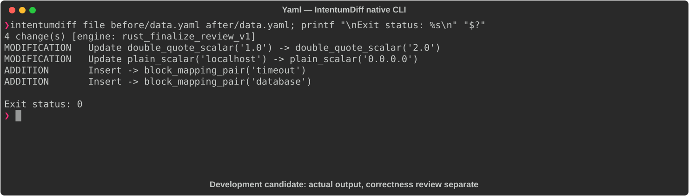

# Yaml

[All languages](../gallery.md)

These real terminal captures use a historical development build. They are not current release certification; independent output review and current installed-wheel scenario checks remain pending.

## Overview

This worked example compares `data.yaml`. Advertised filename extensions: `.yml`, `.yaml`.

## What changes

Change version string 1.0 to 2.0 and server host localhost to 0.0.0.0; add timeout string 30s and database host/port/name mapping; preserve server port 8080.

## Before

````text
name: my-app
version: "1.0"
server:
  host: localhost
  port: 8080
````

## After

````text
name: my-app
version: "2.0"
server:
  host: 0.0.0.0
  port: 8080
  timeout: 30s
database:
  host: db.example.com
  port: 5432
  name: mydb
````

## Things to know

- Timeout 30s is a string; it is not the numeric timeout 30 used in the XML example.

## Recorded output



Recorded from a real native CLI through rs-rich-record. A refactoring label does not prove equivalent behavior. [Build identities](../provenance.md).

## Scenario coverage

| Scenario | Status |
|---|---|
| Meaningful edit | Source example reviewed; output captured; independent result certification pending |
| Unchanged content | Not yet certified for this candidate |
| Populate / clear a file | Not yet certified for this candidate |
| Add / delete an entity | Not yet certified for this candidate |
| Rename a symbol | Not yet certified for this candidate |
| Move / reorder code | Not yet certified for this candidate |
| Formatting only | Not yet certified for this candidate |
| Git file rename / move | Not yet certified for this candidate |
| Mixed move and edit | Not yet certified for this candidate |
| Invalid syntax / actionable error | Not yet certified for this candidate |
| Guardrail review | Not yet certified for this candidate |

## Try it

Save the two source blocks as separate files with the shown extension, then compare them:

```bash
intentumdiff file before/data.yaml after/data.yaml
```

The installed Python wheel includes its parser components. The native CLI requires a component directory. Compare the result with the source change described above; agreement between APIs alone is not proof of correctness.
