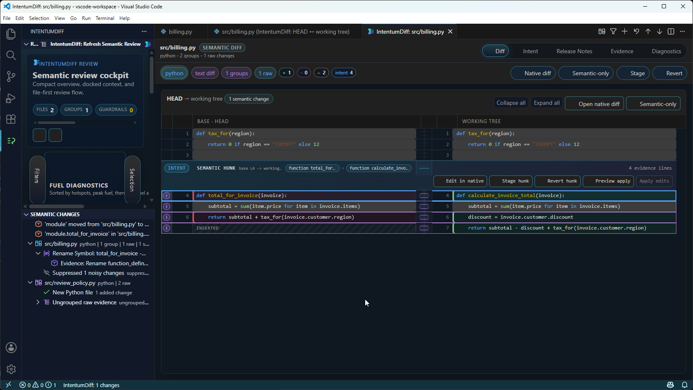
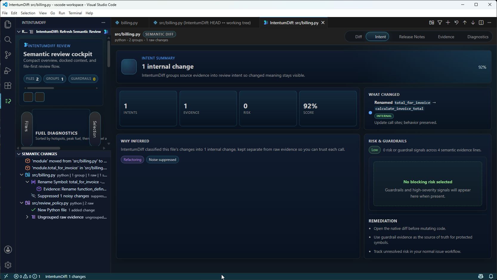
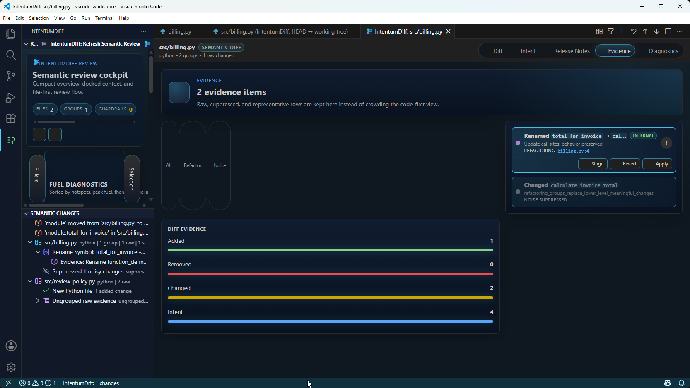
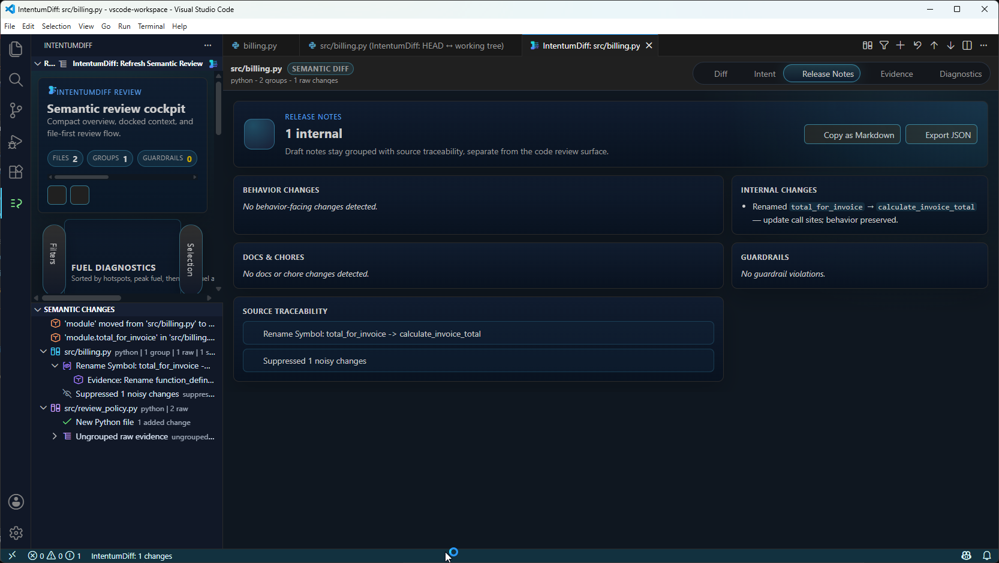
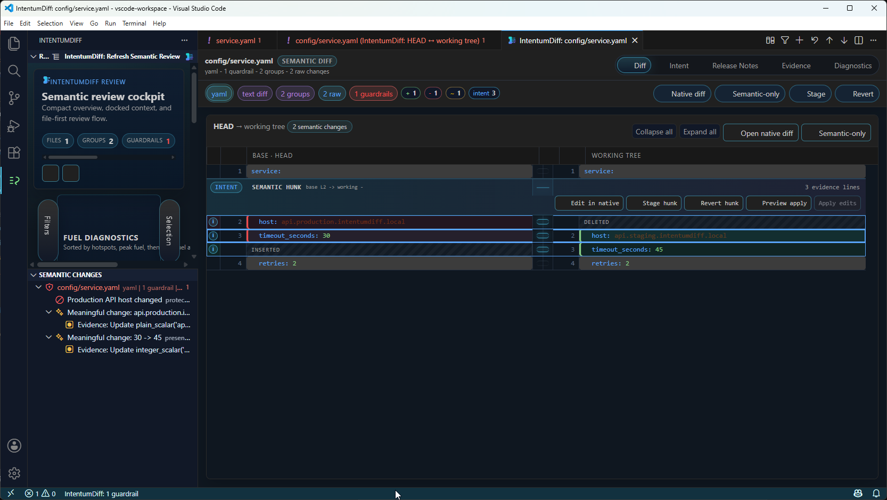
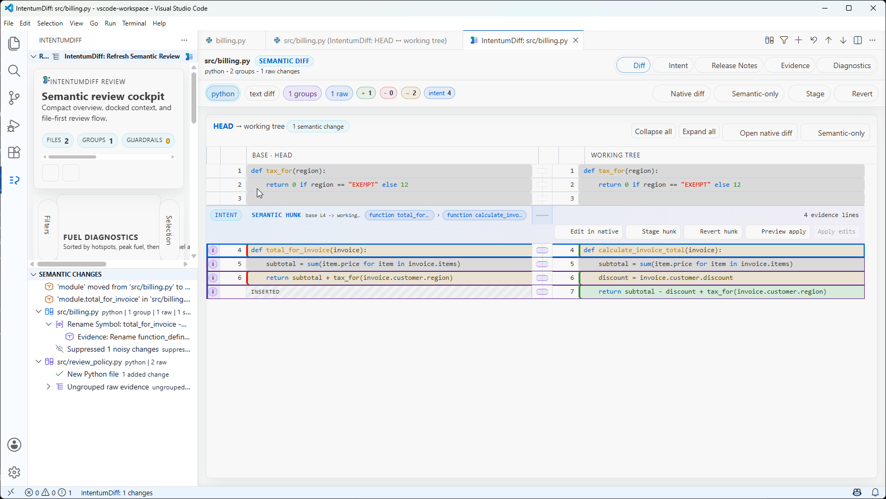

# VS Code extension

The extension puts intent into the editor you already use. It does **not** replace the diff
editor — VS Code's native diff stays exactly as it is, and IntentumDiff annotates it.

!!! important "It needs the engine"

    The extension is a thin front end over the `intentumdiff` command. Install the engine
    first — see [Getting started](getting-started.md). Without it the extension has nothing
    to talk to.

## What you see

<figure markdown>

<figcaption>The review surface — semantic changes on the left, the native diff on the right</figcaption>
</figure>

- **CodeLens above each change** — `CATEGORY · why`, so the classification and its reason sit
  next to the code rather than in a panel you have to go and find
- **Semantic decorations** coloured by category, bound to your theme
- **A peek view** for the detail behind a classification
- **A review summary** with intent, release notes, evidence and diagnostics

### Intent

The Intent tab answers "what did this change actually do?" — a summary, the derived facts, and
the reasoning behind the classification.

<figure markdown>

<figcaption>Intent — what changed, why it was classified that way, and the risk</figcaption>
</figure>

### Evidence and release notes

<figure markdown>

<figcaption>Evidence — the raw changes behind every classification, so a label can be checked</figcaption>
</figure>

<figure markdown>

<figcaption>Release notes, generated from the diff rather than the commit messages</figcaption>
</figure>

### Guardrails

Protected-config violations are surfaced separately, because they are the ones that should
block a merge.

<figure markdown>

<figcaption>Guardrails — protected settings, immutable fields and resource identity changes</figcaption>
</figure>

### It follows your theme

<figure markdown>

<figcaption>Light theme — chrome binds to your editor's colours, not a bespoke palette</figcaption>
</figure>

- **CodeLens above each change** — `CATEGORY · why`, so the classification and its reason sit
  next to the code rather than in a panel you have to go and find
- **Semantic decorations** coloured by category, bound to your theme
- **A peek view** for the detail behind a classification
- **A review summary** with intent, release notes, evidence and diagnostics

Risk is derived from the category rather than configured separately: behavioural changes
surface as behaviour, refactorings and moves as internal, style as excluded, and guardrail
violations as critical.

## Editing while you review

The right-hand side of the diff is the **real working-tree file**, so it stays editable. Fix
something mid-review and the engine re-runs, refreshing the intent annotations as you type.

## Settings

| Setting | Purpose |
|---|---|
| `intentumdiff.executable` | Path or command name for the engine. Machine-scoped |
| `intentumdiff.ref` | The git ref to compare against |
| `intentumdiff.liveServer.engine` | `auto`, `native` or `python` |

`intentumdiff.executable` is machine-scoped on purpose: a workspace cannot override it, so
cloning a repository can never cause your editor to run a binary that repository chose.

## Theme

Chrome follows your editor theme rather than a bespoke palette, and change categories use
contributed colour IDs (`intentumdiff.semanticChanges.*`) which you can override:

```json
{
  "workbench.colorCustomizations": {
    "intentumdiff.semanticChanges.meaningful": "#e06c75"
  }
}
```

It is designed to read correctly in Dark+, Light+ and High Contrast.

## If it does not work

See [Troubleshooting](troubleshooting.md) — the usual cause is that VS Code's `PATH` does not
include the environment the engine was installed into.
