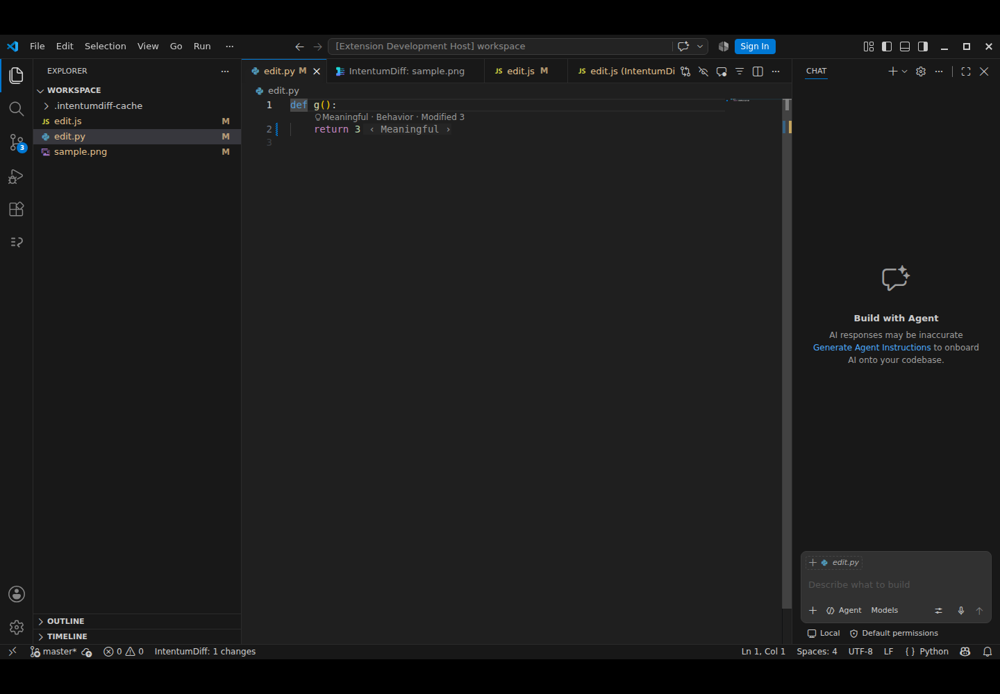
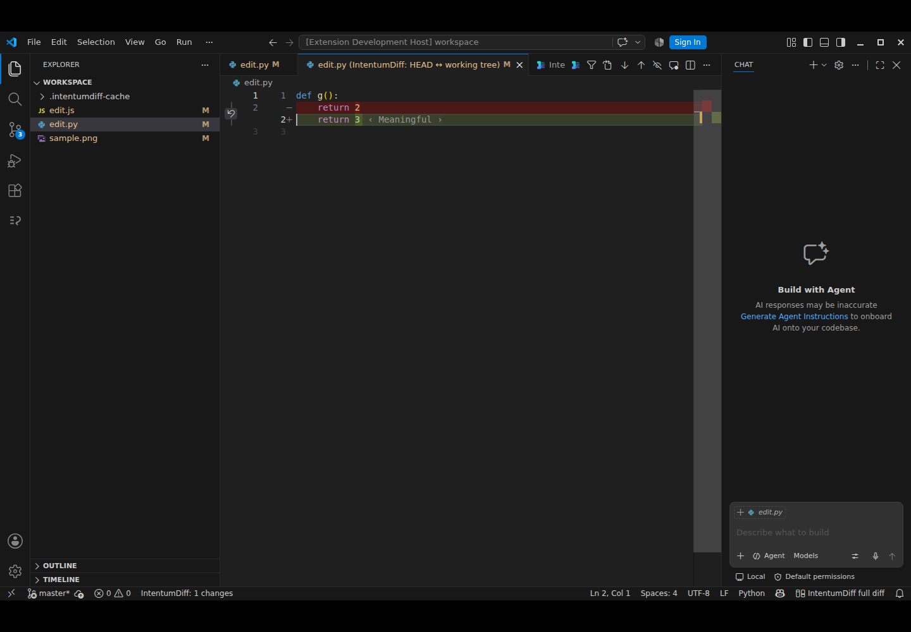
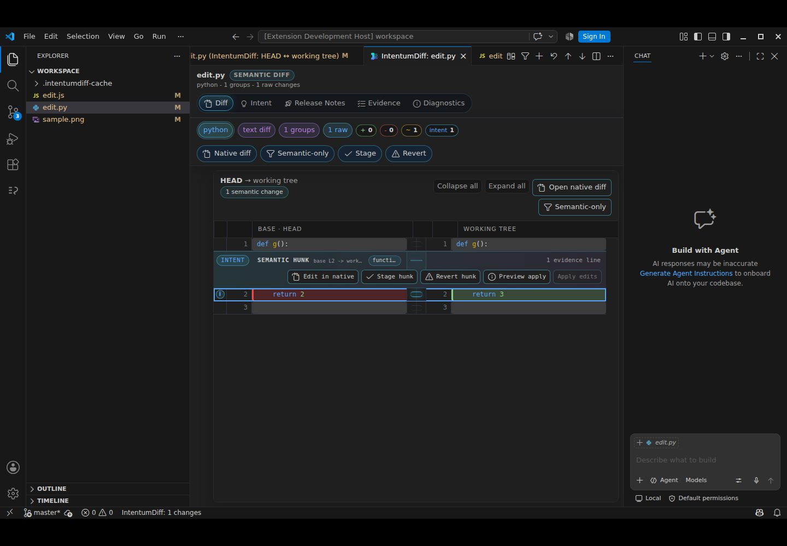
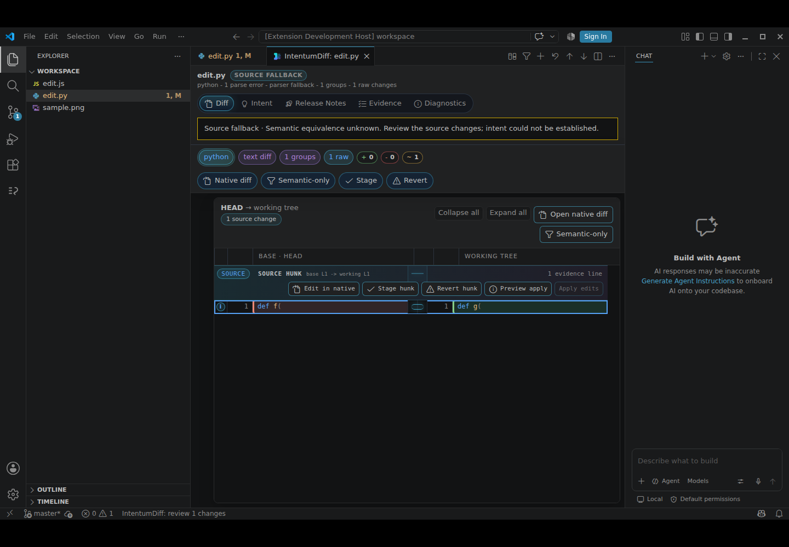
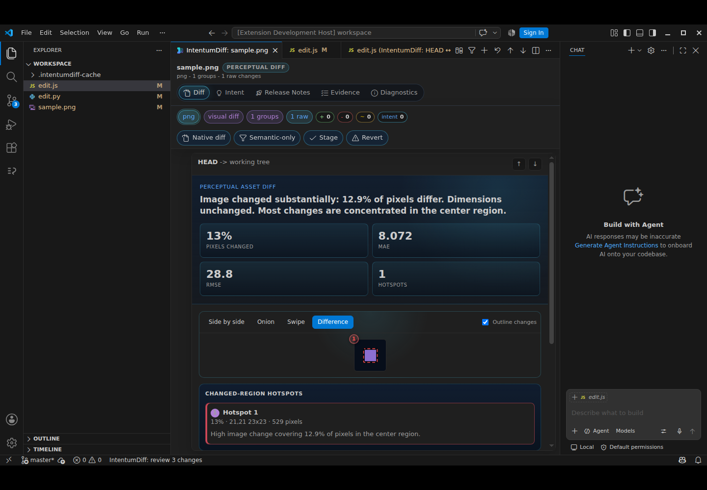
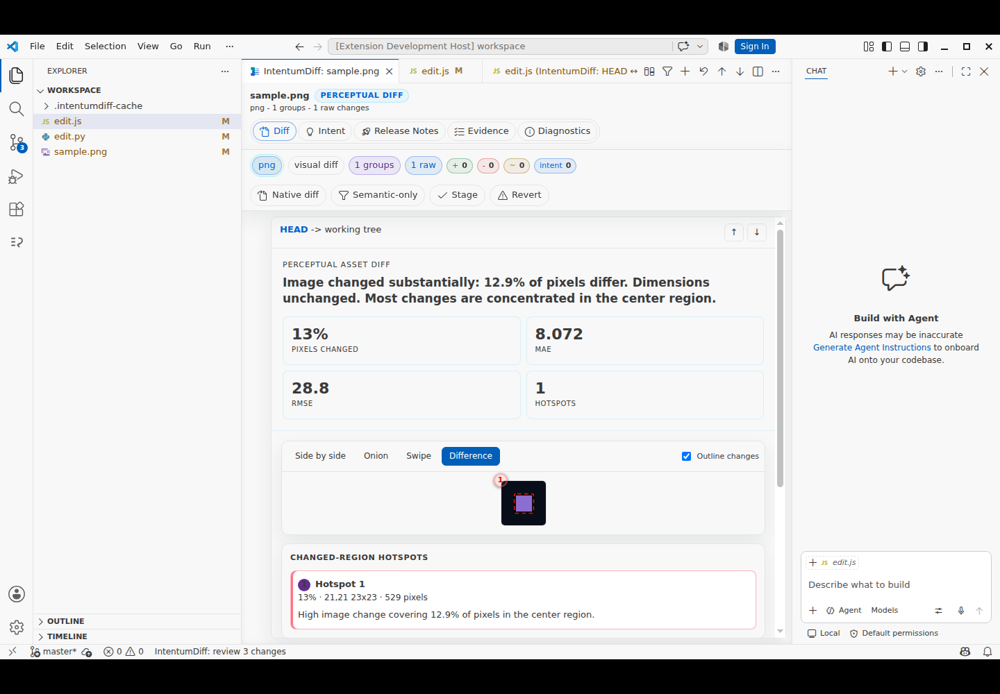
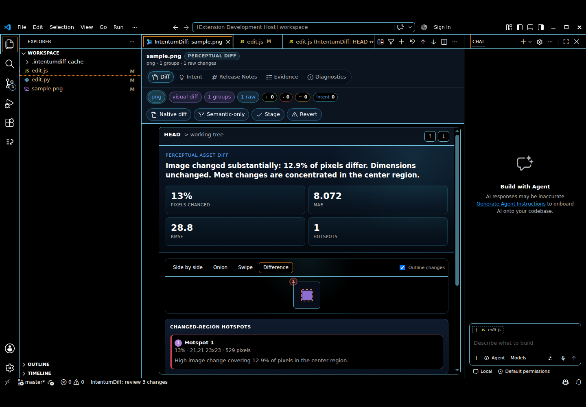
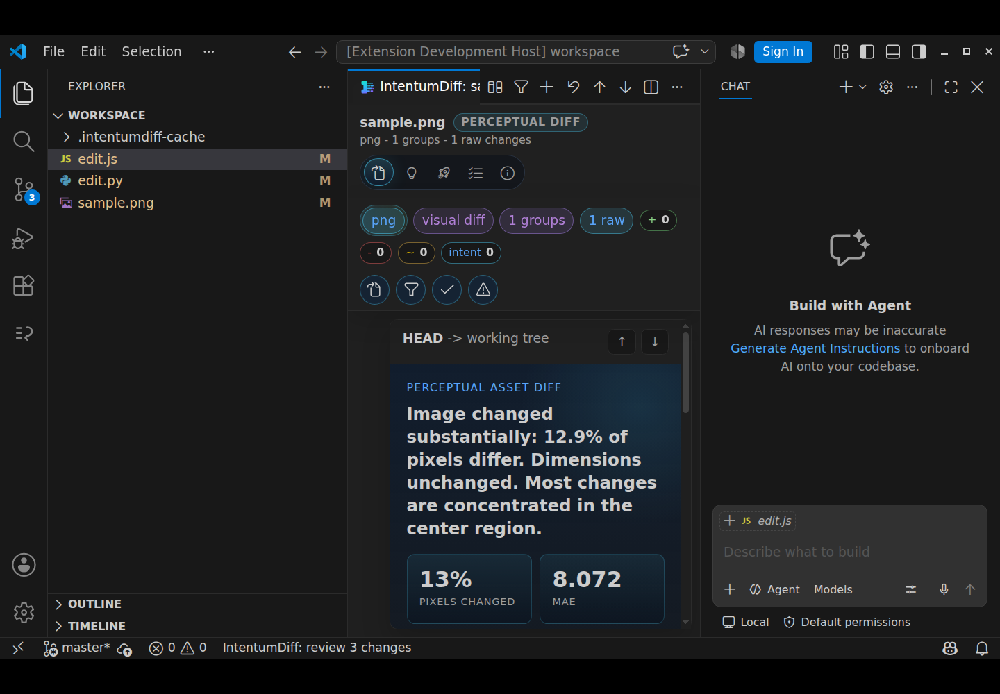

# VS Code extension

Review what a change means alongside VS Code’s native diff. The extension displays results
from the Rust engine through an external `intentumdiff` runtime; the VSIX does not bundle
Python or the native engine.

Install the runtime using [Getting started](getting-started.md), then set
`intentumdiff.executable` if it is not on VS Code’s `PATH`. Choose your comparison base with
`intentumdiff.ref` (normally `HEAD`). Save a change and run **IntentumDiff: Refresh Semantic Review**.

Watch the [16-second desktop workflow](vscode/workflow/index.md) for CodeLens → native diff → review.

## Understand a change while editing

CodeLens puts the classification beside the changed source. This real Python example changes
`return 2` to `return 3`: the returned value changes, so a behavioural change is expected.

Use **Show Semantic Diff Overlay** to display annotations, **Hide Comment Changes** to reduce
comment noise, and **Configure Visible Change Types** to choose the categories displayed.
These controls change the view; they do not change the engine’s classification.

## Compare the actual source

Open **Full VS Code Diff** to inspect the original and working-tree source. The native editor
shows the `2 → 3` edit directly, so you can check the semantic label against the code.

**Next Semantic Change** and **Previous Semantic Change** navigate between changes.
**Open Semantic-Only Native Diff** focuses the comparison; expand or collapse semantic diff
context when you need more surrounding code. Peek provides change detail beside the editor.
Fresh dedicated captures of Peek and these navigation controls are still pending.

## Review intent and evidence

Open **IntentumDiff: Open Custom Review** for the selected file. Read the intent group,
then check its source evidence. This capture shows the valid Python edit after recovering
from an incomplete edit.

The review toolbar exposes native diff, semantic-only diff, file staging and file revert.
Stage and revert modify your working tree or index; inspect the file before using them.
Use the **Intent** and **Evidence** tabs to move between the summary and supporting detail.
The current review view has no separate evidence drawer or review rail; legacy command names
do not demonstrate that those panels exist.
The dashboard and grouping controls help navigate a review involving several files.

Intent, evidence, release notes and guardrails serve different purposes: understand the
classification, inspect the underlying change, describe it for readers, and check protected
settings. Dedicated current captures for those views and Git actions remain on the
[capture coverage checklist](vscode-evidence.md#coverage).

## Recognise incomplete source and recovery

While you type, source may not parse. **SOURCE FALLBACK** means the engine can report a source
change but cannot establish semantic equivalence. It is not a successful style-only result.
The visible parse-error count explains why the review needs caution.

This still shows the completed fallback result; it does not show the loading transition.
Fix and save the source to obtain a parsed review again, as in the recovered review above.
See the [Python](languages/python/README.md#vs-code-incomplete-edit) and
[JavaScript](languages/javascript/README.md#vs-code-incomplete-edit) examples for the exact incomplete edits.

## Review image changes

Image review presents the engine’s image comparison, metrics and hotspots. Use its comparison
modes to inspect where pixels changed. Read [Diffing images](assets/index.md) for the meaning
of the metrics and available views.

### Light and high-contrast themes

The same comparison is captured in each theme; the reported metrics agree.

### Narrow layout

The title, summary and metric labels wrap in a narrow viewport. The image controls and
hotspots are below this capture’s visible area, so their narrow-layout usability still needs
separate evidence. Icon-only toolbar tooltips and accessible names also need interaction checks.

## Settings and troubleshooting

| Setting or command | When to use it |
|---|---|
| `intentumdiff.executable` | Choose the installed external runtime; this setting is machine-scoped |
| `intentumdiff.ref` | Choose the Git reference to compare against |
| `intentumdiff.liveServer.engine` | Select `auto`, `native` or `python` runtime transport |
| **Show Output** | Inspect runtime messages |
| **Open Diagnostics** | Inspect the runtime and extension state |
| **Restart LiveServer** | Restart after correcting runtime configuration |
| **Export Diagnostics Report** | Prepare diagnostic information to inspect before sharing |

For setup failures, see [Troubleshooting](troubleshooting.md). An engine failure must remain
an error; an empty review is not a substitute for a failed comparison.

## Examples and capture provenance

Start with the [language guides](languages/gallery.md) for before/after examples. Current
VS Code screenshots cover Python and JavaScript; the remaining language screenshots are
pending. CLI screenshots in the language guides are separately identified.

All screenshots on this page came from an installed VSIX running against a real external
runtime in a clean test profile. See [capture identities and coverage](vscode-evidence.md)
for the exact candidate and limitations. They are pre-publication evidence, not verification
of a Marketplace release.
